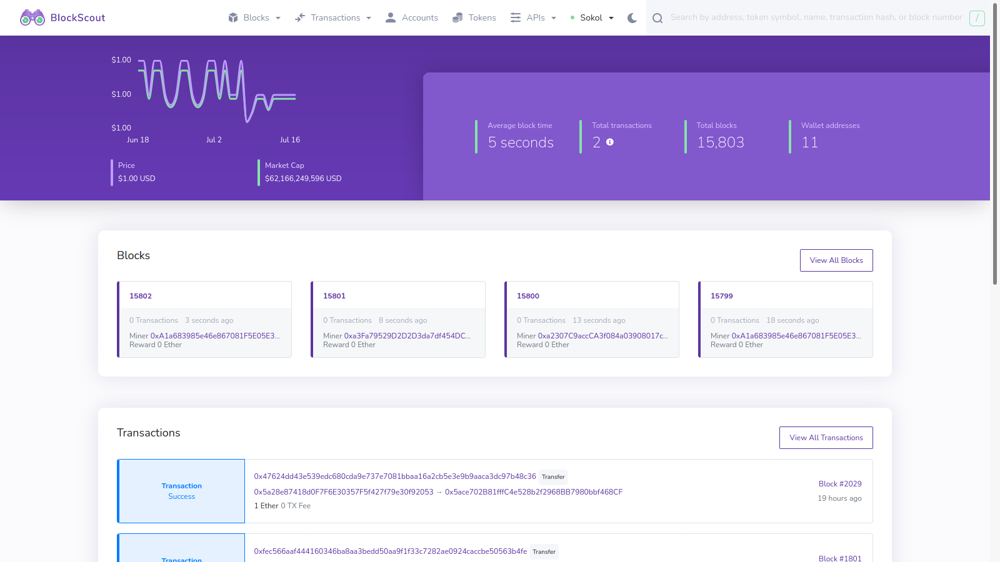

# Bienvenido a Latam-Blockchain

Latam-Blockchain Resil es una red federada, cadena de bloques y protocolo, asegurado por un conjunto de miembros validadores, estos se encuentran distribuidos globalmente en pro de asegurar la operatividad de la red, dichos miembros federados son empresas publicas e instituciones relacionadas al sector tecnológico-financiero. Este grupo distribuido de validadores permite a la red realizar transacciones inmediatas y a bajo costo.

Como organización Latam-Blockchain promueve el desarrollo del sector tecnológico-financiero con el estudio de soluciones con cadenas de bloques para Activos Digitales de Bancos Centrales y Activos digitales personalizados [Locha-USD](https://locha-usd.github.io/)

Participar en la red Resil de Latam-Blockchain te ayudará a experimentar y crear una aplicación de primera clase en nuestra plataforma. ¡Bienvenido a Latam-Blockchain!

## **Porque Latam-Blockchain?**

* ✅Red, cadena de bloques y protocolo ajustado a las necesidades de la región.
* ✅Confirmación de transacciones de \(5 segundos\).
* ✅Impuesto de transaccional de \($ 0.005\).
* ✅Dinero digital. Una cadena con $ USD dolar como moneda nativa es ideal para aplicaciones de intercambio de valor.
* ✅Cadena de bloques eficiente y compatible con el ahorro energético.
* ✅Acceso a los mercados internacionales y liquidez a través de USDT\(Tether\) en todas sus cadenas & redes.
* ✅Mecanismo de consenso de Prueba de Autoridad permite distribuir la federación de la red globalmente. 
* ✅Compatible con contratos inteligentes de Ethereum y demás cadenas _EVM_.
* ✅Soporte en castellano y equipo de desarrollo local.
* ✅**WIP**

## Sobre nuestro Logo

Nuestro logo representa ingenio, eficiencia energética y compromiso con la región.

