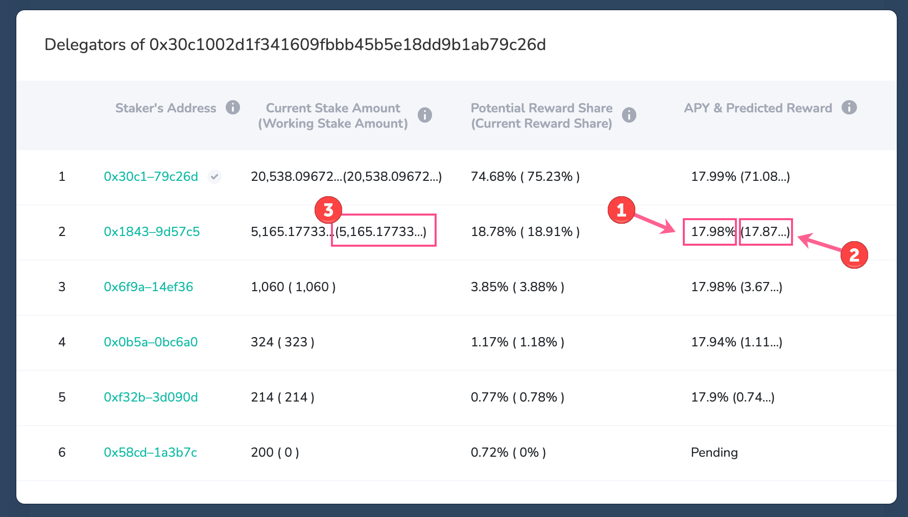

# Public Staking \(Validators & Delegators\)

## How do I access the staking application?

The app is located in the  block explorer, available at [https://explorer.latam-blockchain.com](https://explorer.latam-blockchain.com). Go to the Apps dropdown and select **Staking** to access.

Once you are in the DApp, connect your web3wallet \(like MetaMask\) \(Login\) to participate. 

## What is a validator?

A validator runs a node that verifies transactions and finalizes blocks on Latam-Blockchain. Each validator must provide the minimum LATAM collateral \(20K LATAM\) into their pool and setup a functional node to participate. They start as candidates, and have the chance to become validators each week when a new validator set is chosen.

## What is the maximum number of validators?

The max number of validators in a validator set is 19. This is called a validator set and is chosen each week from the group of validator candidates. 

## What is the maximum number of validator candidates?

The maximum number of candidates is 3000.

## How are validators selected?

If there are more than 19 suitable candidates, the top 19 are chosen based on the total amount of stake in their pool + a random number.

## What is a delegator?

A delegator is a LATAM holder who places  in a validator candidates pool. If that candidate becomes a validator, the delegator also receives rewards. By placing LATAM, delegators vote on the candidates they think will make the best validators. 200 minimum delegation per validator candidate.

## How long is a staking epoch?

Each staking epoch is ~1 week \(120992 blocks\).

## How does a participant \(validator, candidate or delegator\) add/withdraw/claim LATAM stake?

A [UI integrated with BlockScout](https://explorer.latam-blockchain.com/validators) lets delegators and validators easily manage their LATAM tokens. For more info, see the [Staking Operations](../../latam/staking-protocol/staking-operations/) section.

## How do I get my LATAM stake rewards as a validator/delegator?

Rewards are distributed at the end of a staking epoch to active validators and delegators. Participants must [claim their LATAM using the claim function](../../latam/staking-protocol/staking-operations/claim-stake.md) to get rewards back to their wallet.

## How do I unstake/ stop delegating on a specific validator?

You will order a withdrawal for the **entire delegation amount**. At the end of the epoch, you will be removed as a delegator for that validator. See the question below for more details on the process.

## I ordered a withdrawal but don't see how to claim the withdrawal. What do I do?

You will need to wait until the staking epoch ends to claim your withdrawal. The claim functionality will be available at the beginning of the next epoch. Here are the general steps for withdrawing and claiming LATAM stake.

1. Order a withdrawal
   1. If you want to maintain your delegator status, be sure to leave at least 200 LATAM.
   2. If you want to remove yourself as a delegator, order the entire amount for withdrawal.
2. Wait until the staking epoch ends
3. After the epoch ends, a claim icon will appear. You will process this transaction and your ordered LATAM will be added to your wallet.

[This page details the process along with a video tutorial](../../latam/staking-protocol/staking-operations/claim-stake.md#claim-ordered-withdrawals). 

## I don't see any icons to withdraw or add LATAM. Why not?

In all likelihood you are looking at the app during the final blocks of a staking epoch. During the last **4332 blocks** all staking actions are disallowed. This prevents any potential validator set manipulation at the end of an epoch. To prevent confusion, all staking-related icons \(withdraw, add, claim, move\) are temporarily removed from the UI. They will appear again once a new staking epoch begins.

## What rewards can I expect as a participant?

See the [rewards in a dual token environment post](../../latam/latam-token/latam-reward-mechanics/rewards-in-a-dual-token-environment.md) for more information. Rewards are based on how much LATAM is staked in the protocol as well as chain-based activity \(stable rewards come from bridge fees and transactions\). Staking rewards accumulate based on the locked amount, number of delegators, and validator performance.

## What is APY \(Annual Percentage Yield\)? 

APY is the current annual yield a pool and delegator are receiving on their staked amounts. While 15% is accrued by pools for all active LATAM in the protocol, other factors contribute to individual pool and delegator rewards.

APY is a dynamic number which adjusts often based on the number of delegators in a pool, the number of blocks skipped by a validator, and rewards from bridge fees. All of these can have an impact on the expected APY. The percentage of stake held by delegators typically has the largest influence. Pools with a lower Stakes Ratio typically have a higher APY, but have a lower likelihood to be selected as validators once there are more than 19 total validators.

The APY listed is the expected APY if all staking ratios remained as they are currently. **It is not a long-term expected APY**. The system is constantly updating \(skipped blocks, bridge fees, stakes added and removed\) and the APY adjusts accordingly.

## How do I find the APY

You can quickly find the current APY for each delegator through the delegation popup. In this example:

* **1** is the current APY \(17.98%\)
* **2** is the expected reward payout for the epoch \(~17.87 LATAM\). Multiplying this number by 52 gets the expected yearly payout assuming the current staking ratios. In this case, it is ~929.24.
* **3** is the current working LATAM amount. You can divide 929.24 by 5,165.17 to get an approximate expected APY, but it may not match the current APY depending on the makeup of the pool and numbers rounding. _See_ [_How is APY calculated_ ](public-staking-validators-and-delegators.md#how-is-apy-calculated)_below for the exact formula._ 

## How is APY calculated?

The following formula is used by the contracts to dynamically calculate the current APY for a pool and for each individual delegator.  
  
**APY = `Reward Share` \* `Pool Reward` / `Stake Amount` \* `100` \* `Epochs Per Year`**

* **`Reward Share`**: **`stake Amount` / `Total Stake Amount`**. 
  * **`Stake Amount`**: Amount of tokens staked \(_does not include pending stake_\)
  * **`Total Stake Amount`**: Amount of tokens staked by a validator and all delegators in a pool \(d_oes not include pending stake_\) 
* **`Pool Reward`**: **`Total Reward`** \* **`Blocks Created by Pool Validator`** / **`Total Blocks in Epoch`**
  * **`Total Reward`:** Total Reward for all pools \(non-pending stake sum for all validator pools \* 15% APY + Bridge Fees\)
  * **`Blocks Created by Pool Validator`**: Number of blocks created by the current pool validator during the staking epoch
  * **`Total Blocks in Epoch`**: Total blocks created by all pool validators in the epoch. 
* **`Epochs Per Year`**: **`31536000`** \(seconds/yr\) / **`Current Average Block Time`** / **`120992`** \(current blocks/epoch\)

## What is an Inactive Pool?

A pool becomes inactive when a candidate/validator elects to stop participating in the consensus process. This is different from a ban, where a malicious validator is immediately removed from consensus.

If you see a current validator's pool status as inactive, the validator will exit the validator set once the current staking epoch is complete. Prior to the end of the epoch, the validator will continue with their responsibilities, and any delegators will receive rewards once the staking epoch is finished. Rewards may be diminished if the validator's participation was limited during that epoch.

Inactive pools are not considered for the next validator set, and will not become validators again unless the pool is reactivated by the validator. Delegators who remain in an inactive pool for the next epoch will not receive any staking rewards for that epoch.

## If I am a delegator on a validator pool that is inactivated, will I receive a reward? And how much?

Yes, rewards will still be distributed if a pool is inactivated during a staking epoch. Rewards for the current staking epoch will be accrued as usual.

The reward amount depends on how long the validator has been working, and the reward corresponds to the validator's participation in consensus during the staking epoch. 

For example, if the validator was working fine, didn’t disconnect their node, and produced all blocks they should have produced \(went through all AuRa rounds during the epoch\), its pool will receive 100% of the possible pool’s reward.

However, if the validator skipped half the staking epoch \(only produced 50% of blocks they should have produced\), their pool will receive 50% of the max possible pool’s reward. If a validator was malicious and was removed by the system for misbehavior, its pool won’t receive rewards. Pool rewards also depend on how much other participants staked into other pools. [Read more about reward distributions](../../latam/staking-protocol/terminology/protocol-terms.md#reward-distribution-rules).

## Why did a pool become inactive, and who made the decision?

Pool inactivation is the pool validator's decision. They can inactivate themselves through the interface, or they may be inactivated if serious performance issues are not addressed. In the current implementation, a pool can be inactivated through a governance multisignature process in exceptional cases where there are too many block skips or if a node is too weak and works too slowly \(i.e. if the validator significantly degrades network performance\). This is only implemented if a deficient node significantly impacts chain stability. 

In the future a governance mechanism will enable validators to vote on the inactivation process and remove nodes that are negatively impacting chain performance. We plan to implement a monitoring tool which will provide insights into the performance of each validator pool. 

## What can I do if the pool I delegated to became inactive during a staking epoch?

Once the current staking epoch finishes, you can claim your reward and withdraw your staked amount \(or move the stake to another validator pool\). Due to POSDAO protocol rules, it is not possible to withdraw LATAM stake immediately if a pool becomes inactive during a staking epoch. You must wait until a new epoch starts to move or withdraw your stake.

