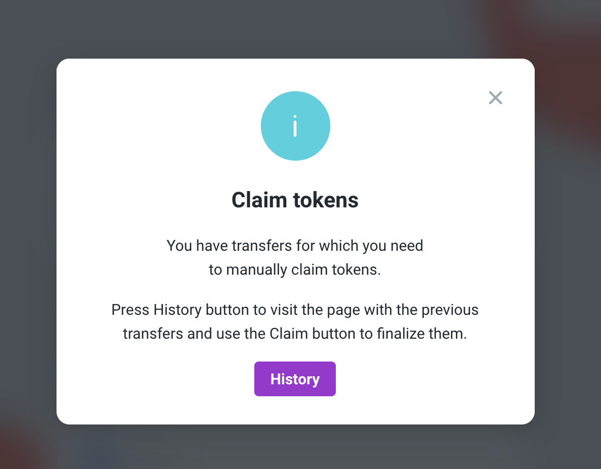
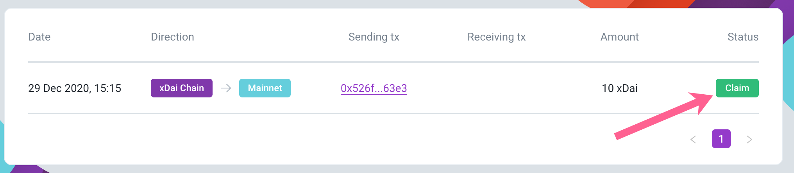

# Bridges: USD Bridge

## USD Bridge FAQs

### Why is the USD bridge important?

The bridge is a key element of Latam-Blockchain, allowing for fast interoperability between Latam-Blockchain and other chains. The bridge connects two networks and allows tokens to exist on both sides. To mint USD, USDT is locked in the bridge contract and the equivalent amount of USD is created on Latam-Blockchain. In order to return this USD to USDT, USD is burned and USDT is unlocked in the foreign chain.

### My transaction is still pending, or was not completed. What should I do?

Please check the [Troubleshooting Section TODO](../../for-users/bridges/converting-xdai-via-bridge/troubleshooting.md) for common issues and resolutions.

### What are the transfer limits when using the USD bridge? 
WIP

The current limits are below. Note that these can be changed by a majority vote from the Governance Board.

|  |  |  |
| :--- | :--- | :--- |
| Max Single Deposit | 9,999,999 USDT | 9,999,999 USD |
| Minimum Transfer | 0.005 USDT | 10 USD |
| Transaction \(Gas\) Fees | variable, paid in Eth | paid in USD |
| Transfer Fees \(in addition to gas fees\) | 0% | 0% |

### What is the Bridge Governance Board?
_WIP_
To extend security and decision making powers to a wider group of participants a \(bridge governors\) exist.

At present there are 13 governors who are responsible for managing bridge operations on both sides of the bridge \(contracts are deployed on the Ethereum and Latam-Blockchain side\). 7/13 signatures are required to approve any management proposal. Operations may include:

* Bridge contract updates.
* Contract parameters updates such as bridge limits, finality threshold, gas price fallback etc.
* Bridge validator parameter updates like changing the validators set or signatures threshold.

All actions are managed through Gnosis Safe accounts, one on the Ethereum mainnet for Ethereum contract side operations and one on Latam-Blockchain.

_TODO_
* [Current Latam-Blockhchain Bridge Governance Board Members](../../for-validators/for-bridge-validators/)
* Gnosis Safe contract on Ethereum: [https://gnosis-safe.io/app/\#/safes/0x42F38ec5A75acCEc50054671233dfAC9C0E7A3F6/settings](https://gnosis-safe.io/app/#/safes/0x42F38ec5A75acCEc50054671233dfAC9C0E7A3F6/settings)
* Gnosis Safe contract on Latam-Blockchain: [https://xdai.gnosis-safe.io/app/\#/safes/0x7a48Dac683DA91e4faa5aB13D91AB5fd170875bd/settings](https://xdai.gnosis-safe.io/app/#/safes/0x7a48Dac683DA91e4faa5aB13D91AB5fd170875bd/settings)

### Who are the USD bridge validators?
_WIP_
There are currently [5 bridge validators](../../for-validators/for-bridge-validators/), and 3/5 signatures are required for bridge transactions. The validator set can be updated by the Governance Board.

### I completed a USDT to USD transfer and see the transaction to lock USDT, but do not see the transaction that mints USD on Latam-Blockchain side. How does it work?

The process requires several steps on Latam-Blockchain side.

1. Oracles send confirmations of the transaction to the bridge contract. 
2. After receiving the required number of confirmations, the bridge contract sends a request to the Block Reward contract to schedule emission \(minting\) of new USD \(the same denomination as requested in the bridge transaction\).
3. The Block Reward contract is invoked by the Latam-Blockchain network validator during the last step of block verification, and account balances are updated in the Block Reward contract. 


Example transaction executing a transfer: [https://blockscout.com/xdai/mainnet/tx/0x799abac45b6c2ab18728b3baa04d112f8af8fba4d34d8078cf93856c71e73b91/internal-transactions](https://blockscout.com/xdai/mainnet/tx/0x799abac45b6c2ab18728b3baa04d112f8af8fba4d34d8078cf93856c71e73b91/internal-transactions)

💁♂ When troubleshooting, check the Coin Balance History in the block explorer for the account in question to find information about balance changes and blocks where these occurred.


### When claiming a USDT transaction on Ethereum, does the user originating the transaction also need to pay for the claim?

No, anyone can pay the fees to process the claim transaction and receive USDT, but the USDT will always be sent to the account set as the receiver in the initial originating request. This functionality opens the door for projects or other entities to pay for gas fees/subsidize the claims on Ethereum.

### I didn't claim my USDT on Ethereum yet \(completed 1st transaction on Latam-Blockchain but not the claim transaction\). Is there a time limit to claim my USDT?

No. The amount will remain locked in the contract until you decide to claim it. If gas prices are high, you may want to wait to execute the claim transaction when prices are more in your favor. For more on dealing with high gas fees for claims, [see this troubleshooting question. TODO](../../for-users/bridges/converting-xdai-via-bridge/troubleshooting.md#gas-fees-for-an-exit-claim-are-very-high-how-can-i-reduce-them)

If you have an unclaimed amount, you will see a message once you connect your web3 wallet to the application.

Click on the History button to see your transactions, then click the Claim button in the history section to claim the transaction. You will need Eth to complete your claim.

### I decided I don't want to bridge my USD to Ethereum, but already processed the first transaction. Can I revert?

No, this is not possible. When the first transaction is complete, the requested amount of USD is burned on Latam-Blockchain. If you want to return the amount back to Latam-Blockchain, you must finalize the transfer \(claim\) on Ethereum and then send back to Latam-Blockchain via the bridge to mint USD once again.

### My transaction was successful, so why do I see "Failed" status for some bridge validators in the ALM application?

Once a quorum of confirmations is reached, the transaction is executed and the remaining confirmations are not required. This saves resources, and creates an easy visual record to see which validators confirmed for any given tx.

Successful transactions are recorded with Status "Success", and additional validator confirmations, which are not needed, are either marked as 'Failed' or 'Not required' depending on the processing order.

