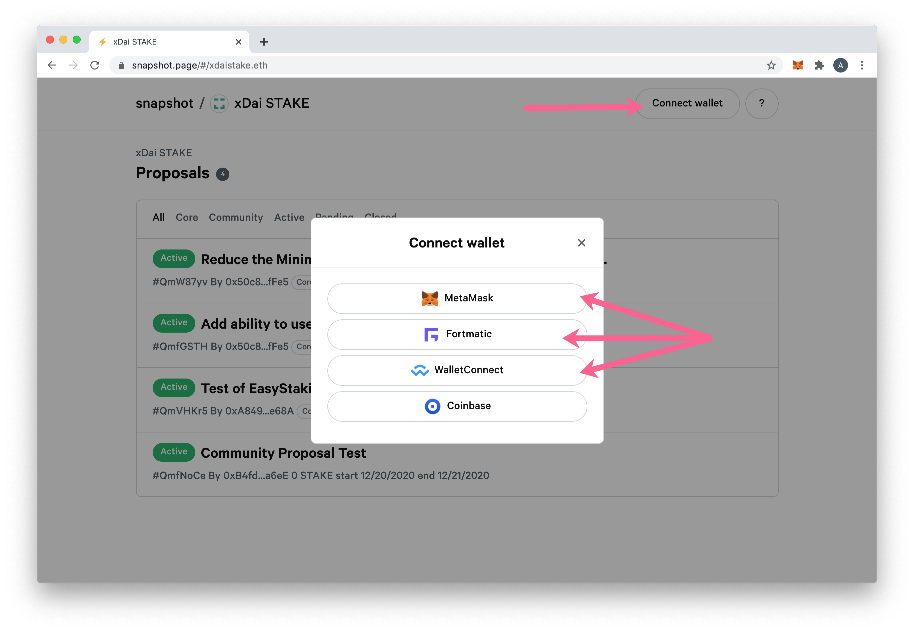
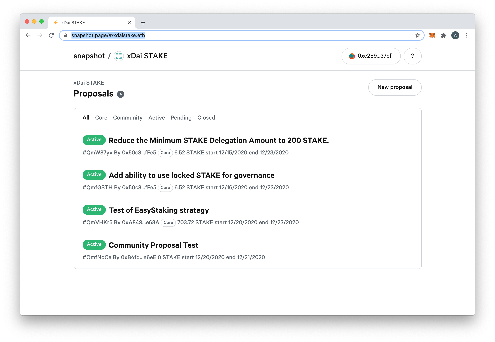
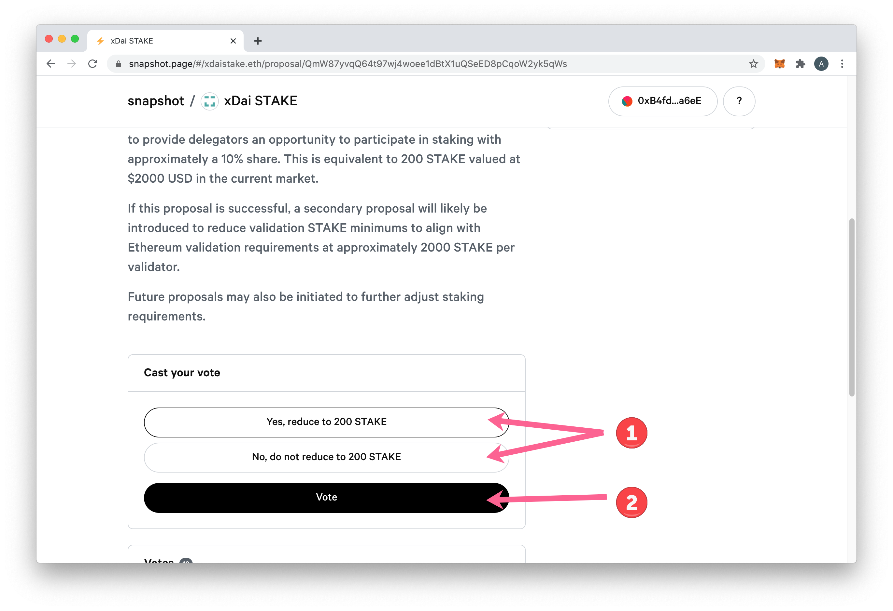
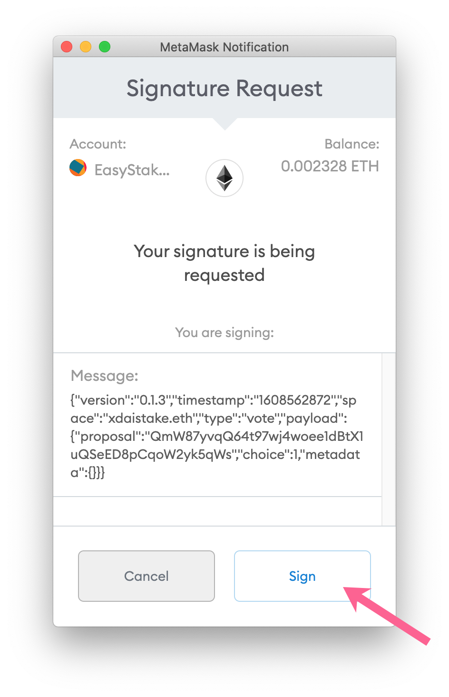
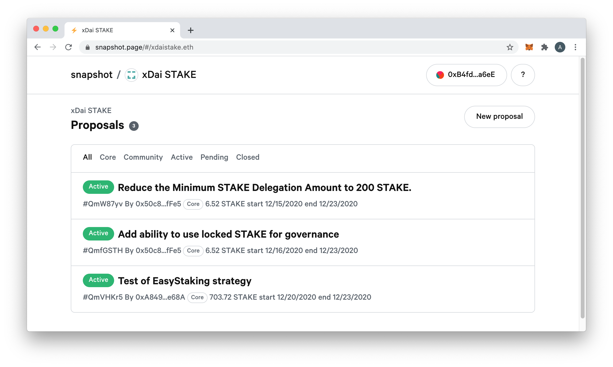
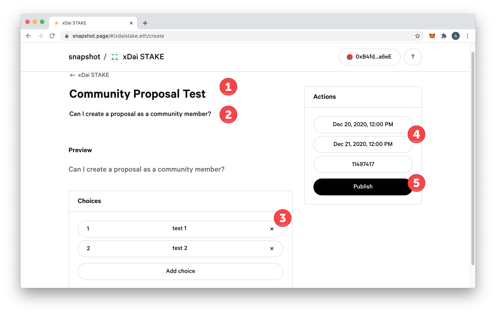
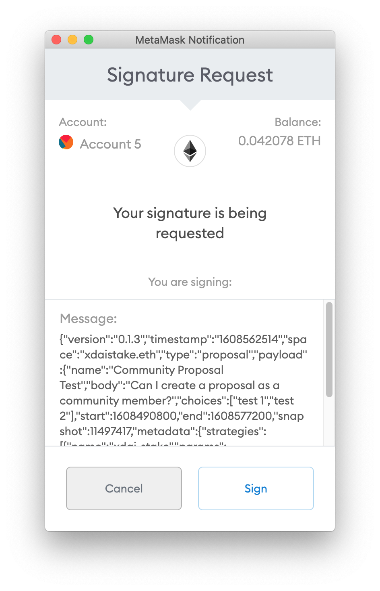
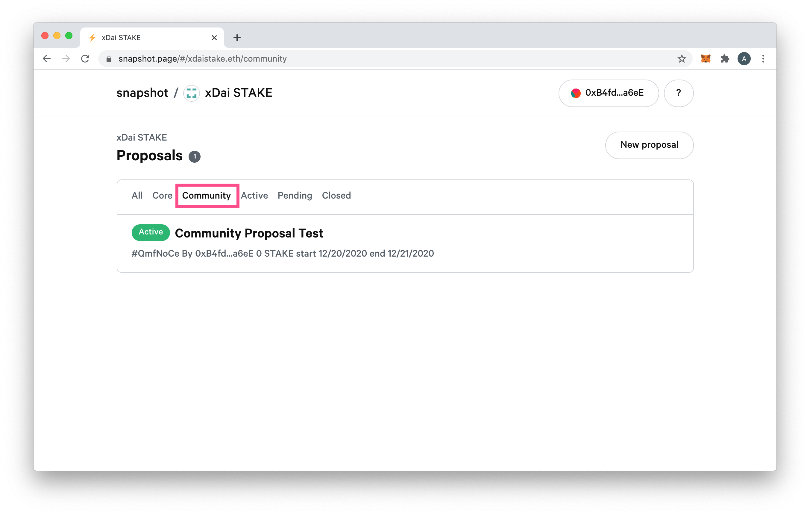

# LATAM weighted voting with Snapshot

LATAM holders participate in the governance process through an integration with snapshot. Community members can vote on proposals and introduce proposals for voting by other members. Once a proposal passes, Latam-Blockchain team works with validators to support the protocol update. 

Note that proposals are not automatically enacted, and some community proposals may not be accepted depending on the viability of the idea or total LATAM amount/ number of voters participating.


Snapshot uses your LATAM balance on Ethereum as well as LATAM locked in EasyStaking for voting weight**.**

* \*\*\*\*[More on Snapshot ](https://docs.snapshot.page/)


## Vote on an existing proposal

1\) Go to the Latam-Blockchain Snapshot Page: [https://snapshot.page/\#/xdaistake.eth TODO](https://snapshot.page/#/xdaistake.eth)

2\) Connect your wallet to Ethereum using Metamask or another application. This wallet should include LATAM you want to use for voting purposes \(or the connected wallet used for EasyStaking, the balances will be combined for your weighted vote\).

3\) Click to select the proposal you would like to vote on.

4\) Read the proposal and scroll to the bottom. Cast your vote by selecting a vote and clicking the vote button.

5\) Sign the transaction in your web3 wallet. A vote does not require ETH.

6\) You can switch your vote by choosing another selection and voting again.

## Create a Proposal

Community members can create a proposal for a vote. This is the first step in suggesting or enacting an upgrade. If accepted by the community, the Latam-Blockchain team will assess the viability of the idea and see what next steps are required. **A passed vote does not guarantee a protocol change, but is viewed as a community suggestion and taken into consideration by the team.**

1\) Go to the Latam-Blockhchain Snapshot Page: [https://snapshot.page/\#/xdaistake.eth TODO](https://snapshot.page/#/xdaistake.eth) and connect your  web3 wallet.

2\) Click on New Proposal.

3\) Fill in all relevant details and Publish. Include the following:

1. Title
2. Proposal Body
3. Voting Items
4. Start and End Dates for the Proposal \* _\(start and end dates use a calendar pop-up which may be off by 1 day. Adjust accordingly.\)_
5. Click Publish.

4\) Sign the transaction. 

5\) Your proposal will appear in the Community section with the suggested parameters \*_Note: spam proposals will be deleted._

\_\_

