# Delegate LATAM voting weight with Gnosis Safe

LATAM held in an EOA \(externally owned address\) on Ethereum and [staked on EasyStaking TODO](https://easy-staking.xdaichain.com/deposits) can be used for [LATAM weighted voting with snapshot TODO](https://snapshot.page/#/xdaistake.eth). LATAM held in a Gnosis Safe multisig account cannot be directly used from that account for voting purposes. However, it can be delegated to an EOA and then used for stake weighted voting. The delegated amount is added to any additional LATAM held in a wallet or in EasyStaking, providing a total signaling weight for voting purposes. 

1\) Go to Snapshot [https://snapshot.page/\#/xdaistake.eth TODO](https://snapshot.page/#/xdaistake.eth) and **Connect wallet** with Wallet Connect.

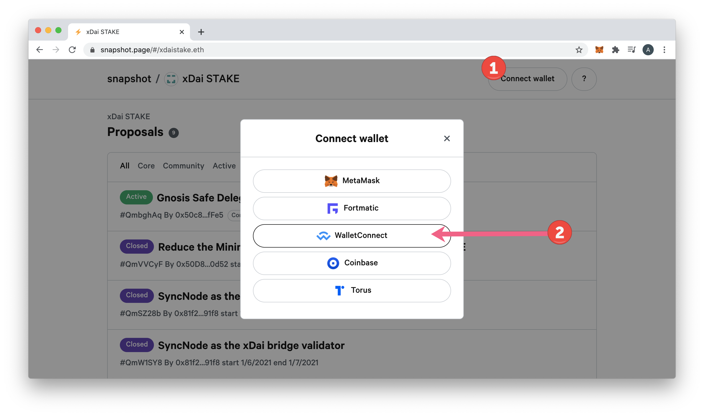

2\) Copy QR Code.

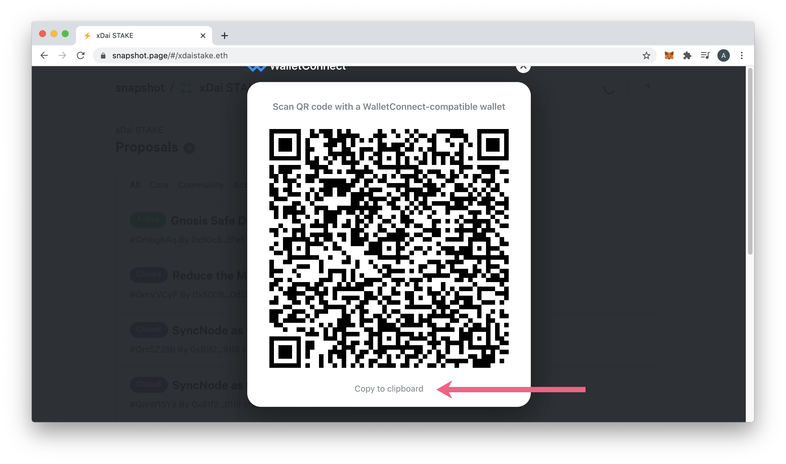

3\) Login to your Gnosis Safe and Go to Apps -&gt; Wallet Connect.

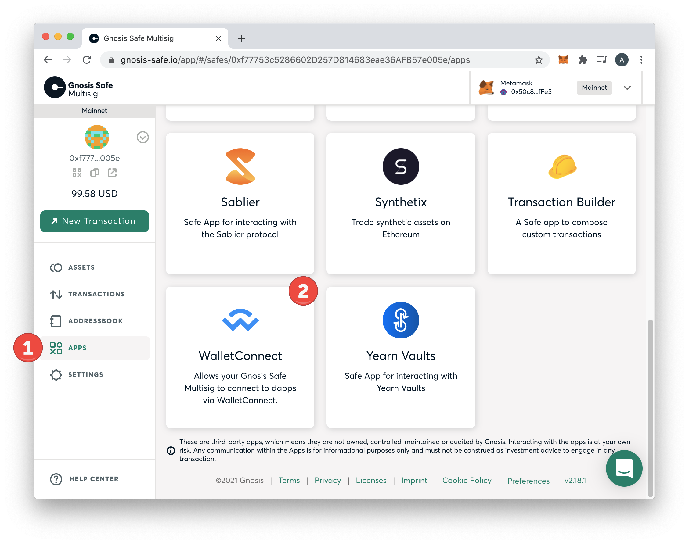

4\) Paste in the copied code.

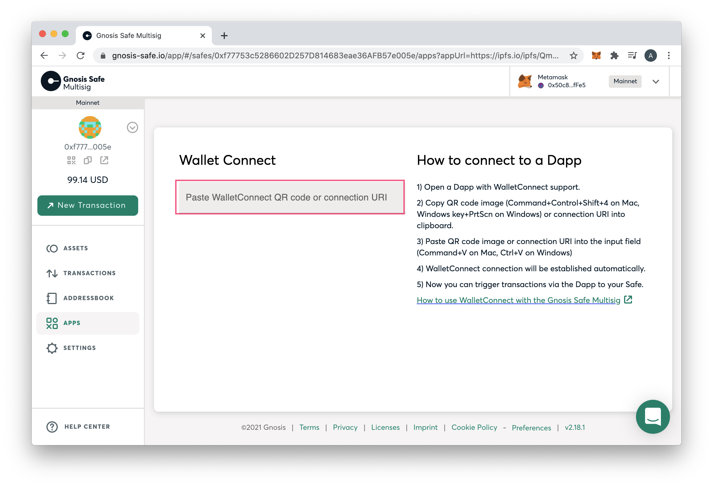

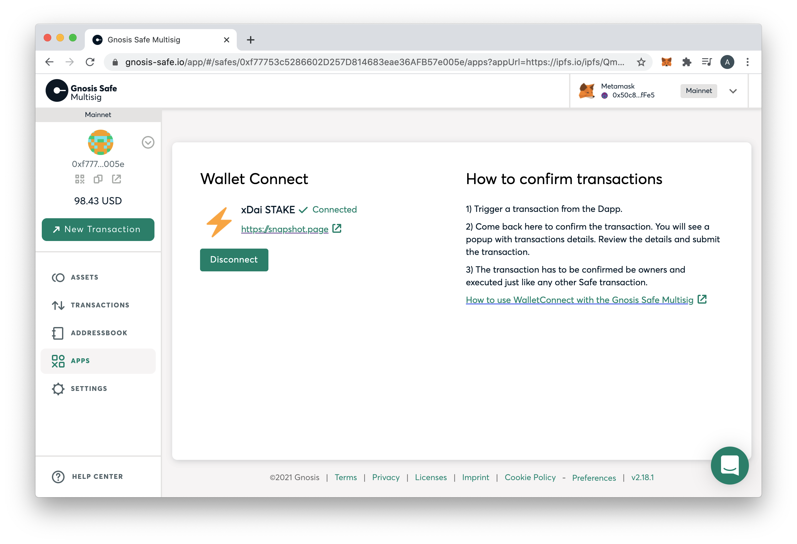

5\) Return to Snapshot and go to the delegate page at [https://snapshot.page/\#/delegate TODO](https://snapshot.page/#/delegate). Enter in the address you would like to delegate to and click confirm. 

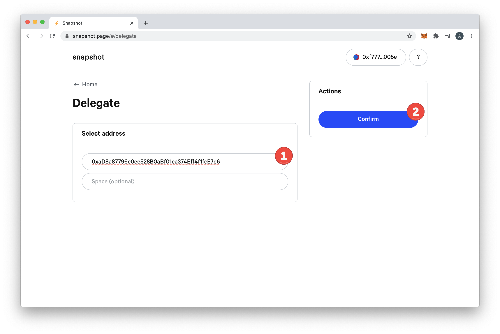

6\) With the related multi-sig threshold, safe users will then need to **submit the transaction and pay gas fees through the Gnosis Safe**. 

7\) Once confirmed you will see the address you have delegated to. If tx is successful and has been submitted for some time but you do not see the address, refresh the page.

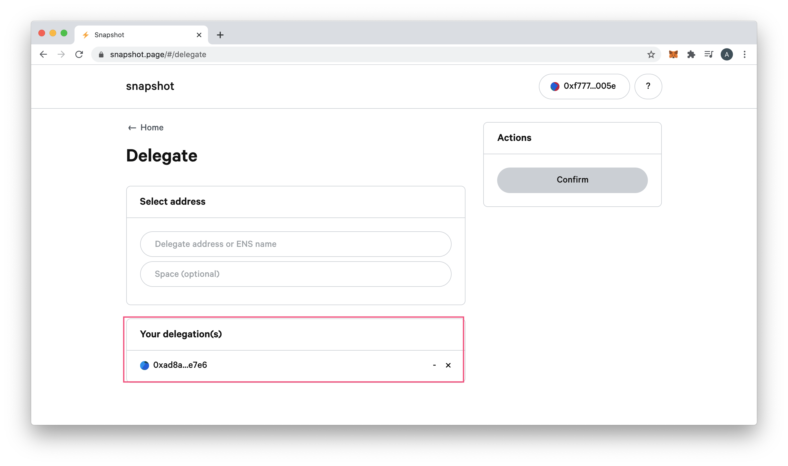

8\) **Logout from your Safe address** in snapshot and click Connect to **login with the address you have delegated to**. 

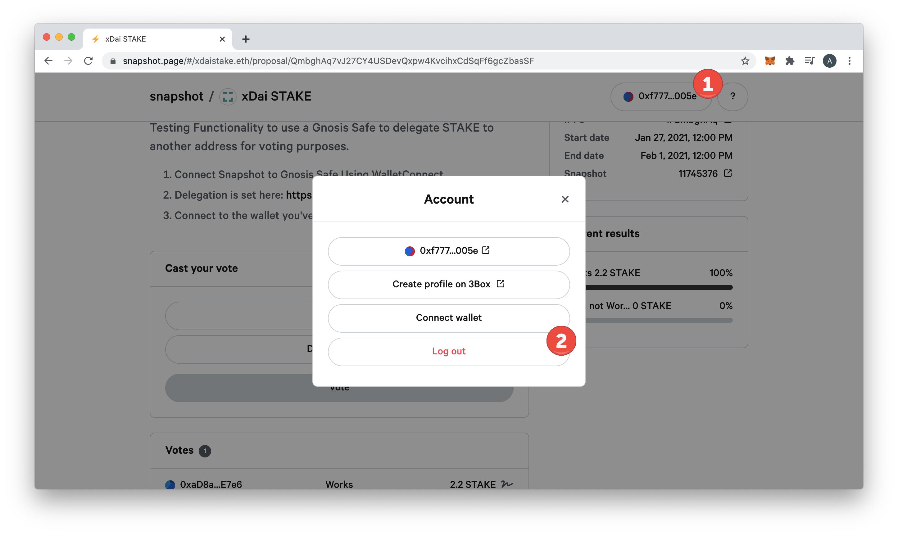

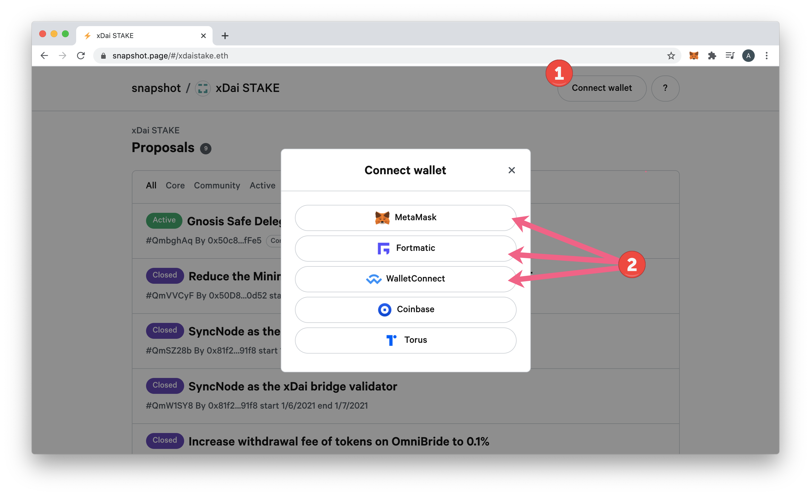

9\) Go to the proposal and vote. Stake weight should be reflected from the Gnosis safe, as well as other sources \(like existing LATAM in your wallet or stake in EasyStaking\). [More on general voting process here.](./)

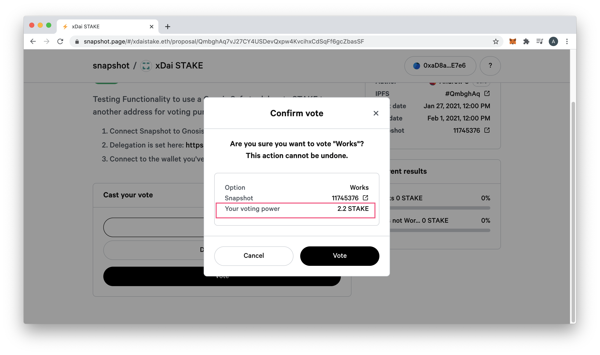

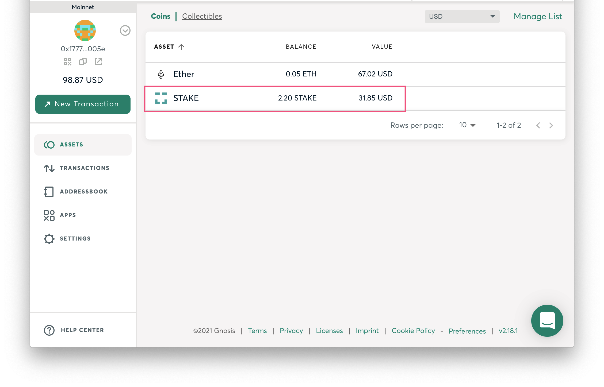


More info in the  Gnosis Governance Tutorial: [https://blog.gnosis.pm/gnosisdao-governance-tutorial-8257f5a1adb4\#7c45](https://blog.gnosis.pm/gnosisdao-governance-tutorial-8257f5a1adb4#7c45)

**Important**: For a delegated address to be effective when signaling on a Snapshot poll, the address has to have been delegated to by the block number set on the Snapshot poll.

**Related**: It is possible to change the delegation address. However, if the original delegated address has already voted on a proposal, the new address will not be able to use the safe weight to vote on the same proposal. The new address will be able to vote on different proposals.


