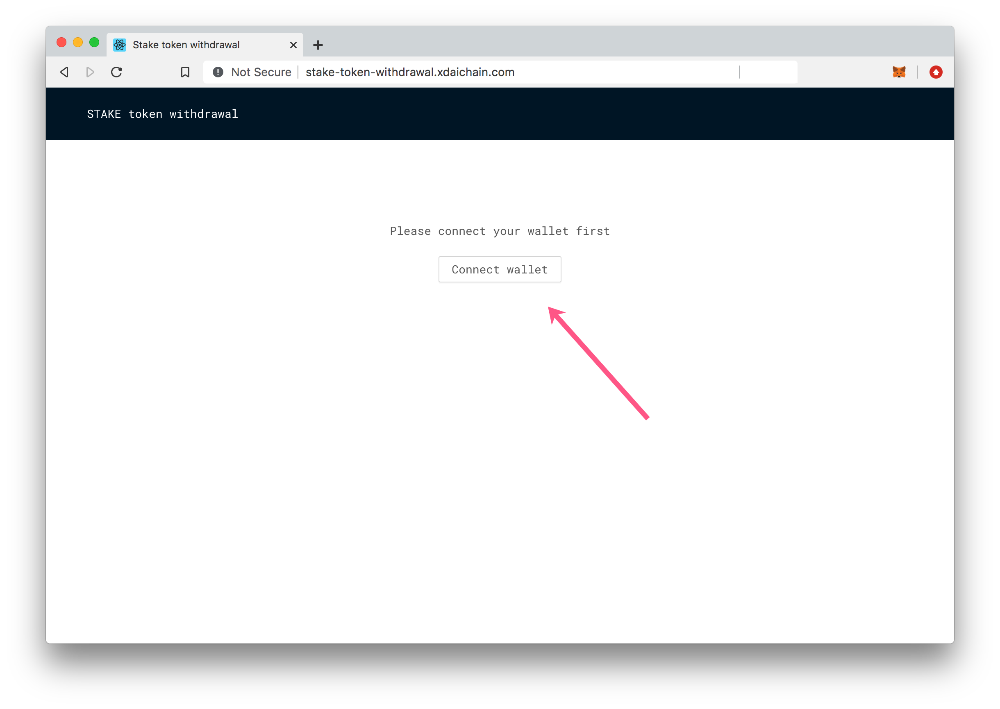
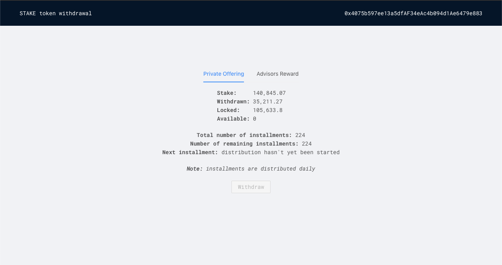

# Claim LATAM: Private Investors & Advisors


LATAM is only on Rinkeby testnet by now, you can ask in our discord server the release dates for Ethereum mainnet or if you are interested in participating in the private rounds or public offer [Discord Server](https://discord.gg/TncBuWdY6B), all contracts showed here may change.



Use this information as reference, the Withdrawal dApp not inplmented yet! please use manual instructions to perform the testnet LATAM Withdrawal



LATAM token address on Ethereum [0x886714772777465613959d35C36d84bb3b5FfB0b](https://rinkeby.etherscan.io/token/0x886714772777465613959d35C36d84bb3b5FfB0b)

Private investor token contract  
[0x919203a7Ae3dCD123648E5072787B664bfeb153F](https://rinkeby.etherscan.io/address/0x919203a7Ae3dCD123648E5072787B664bfeb153F)

Advisors token contract  
[0xAcD4B247a2b74d32571F6eB63263b6eDA235f100](https://rinkeby.etherscan.io/address/0xAcD4B247a2b74d32571F6eB63263b6eDA235f100)


## Release Schedule

Private Investors

* Initial funds available _Pending!_ for withdrawal \(25% released\)
* New funds available _Pending!_ \(10%\) and each day following for the next 224 days. To transfer any available funds, you must follow the withdrawal process \(pull strategy\).

Advisors

* Initial funds available _Pending!_ for withdrawal \(20% released\)
* New funds available each day following for the next 252 days. To transfer any available funds, you must follow the withdrawal process \(pull strategy\).

## MetaMask


If you have already setup MetaMask or other Web3Wallet with LATAM, skip to the [Token Withdrawal Section](claim-latam.md#use-the-latam-token-withdrawal-dapp-to-transfer-stake-to-your-wallet) TODO



If using a hardware wallet to store your tokens \(Ledger, Trezor\) you can connect it to Metamask rather than importing your account. Connecting Metamask instructions: [https://metamask.zendesk.com/hc/en-us/articles/360020394612-How-to-connect-a-Trezor-or-Ledger-Hardware-Wallet](https://metamask.zendesk.com/hc/en-us/articles/360020394612-How-to-connect-a-Trezor-or-Ledger-Hardware-Wallet)


1\) Import your account to Metamask. This is the account you used to obtain LATAM as an Advisor or Private Investor. You can use the private key or JSON file to import \(or Connect Hardware Wallet\).

2\) Add a small amount of ETH to your account to cover transactions \(.05 recommended\).

3\) Add the LATAM token to your wallet

a\) In Metamask click **Add token**

b\) In the **Token Contract Address** input field enter in the LATAM Token address. The remaining details will autopopulate. Click **Next**.

* LATAM Token Address: [0x886714772777465613959d35C36d84bb3b5FfB0b](https://rinkeby.etherscan.io/token/0x886714772777465613959d35C36d84bb3b5FfB0b)

c\) Click **Add Tokens** to add to your wallet view. You will have 0 LATAM tokens to start. In the next steps, you will add LATAM to your wallet.

## Use the LATAM Token Withdrawal DApp to transfer LATAM to your wallet

4\) Go to [http://stake-token-withdrawal.latam-blockchain.com/](http://latam-token-withdrawal.latam-blockchain.com/) TODO

5\) Connect MetaMask.

6\) Once connected you will see information related to your amount of LATAM. This includes:

* `Latam` Your total token amount.
* `Withdrawn` Amount of tokens you have already withdrawn.
* `Locked` Amount of tokens locked for future withdrawal.
* `Available` Amount of tokens available now. You will receive this amount when you process a withdrawal. If 0, you may need to unlock funds prior to withdrawal. 
* `Total number of installments`: Total installments
* `Number of remaining installments`: How many daily installments are left.
* `Next installment`: Installments are released according to the following schedule:

  _Private Investors_

  * 25% released at initialization
  * 10% released on Day 28
  * Daily installments for 224 days following day 28 

  _Advisors_

  * 20% released at initialization
  * Daily installments for 252 days following day 28

7\) Press the **Withdraw\*** button to start the process. This will transfer the entire amount from **Available** to your **Wallet Address**. Confirm the transaction in the Metamask popup.


\*Note - The **Withdraw** button is locked when **Available** is zero. If you see **Unlock funds** button under **Withdraw**, click the Unlock Funds button to create a transaction to unlock the next installment. Confirming this transaction unlocks the installment for all addresses. The amount available will shift from 0 to your amount available for withdrawal.



Once the withdrawal transaction is processed, you should see your LATAM token amount in Metamask, and can transfer/send/exchange as you would any other ERC20 token.


## Optional Manual Instructions

If you have difficulty using the DApp or would prefer withdrawing manually you can use Etherscan. See the appropriate manual instructions below:

* [Private Investor Manual Instruction](claim-latam.md)
* [Advisors Manual Instruction](manual-instructions-advisors.md)

