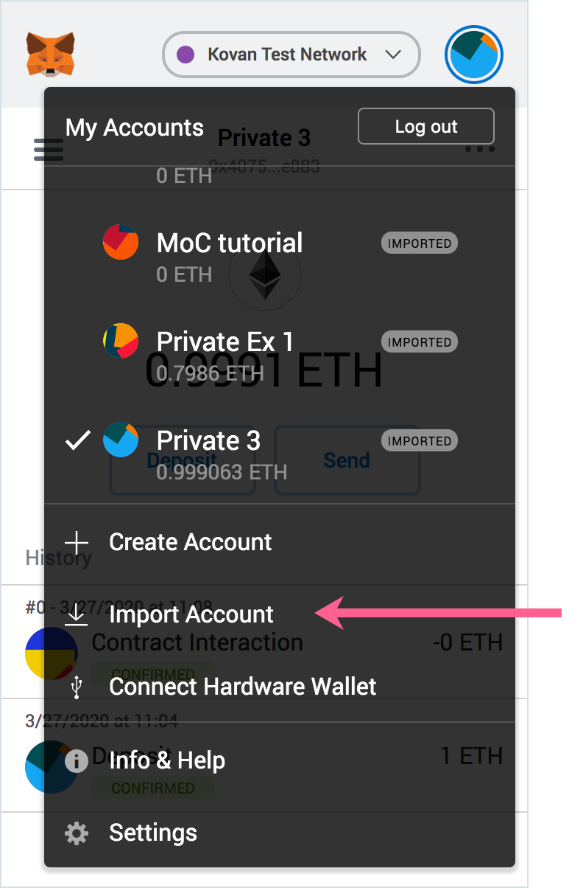
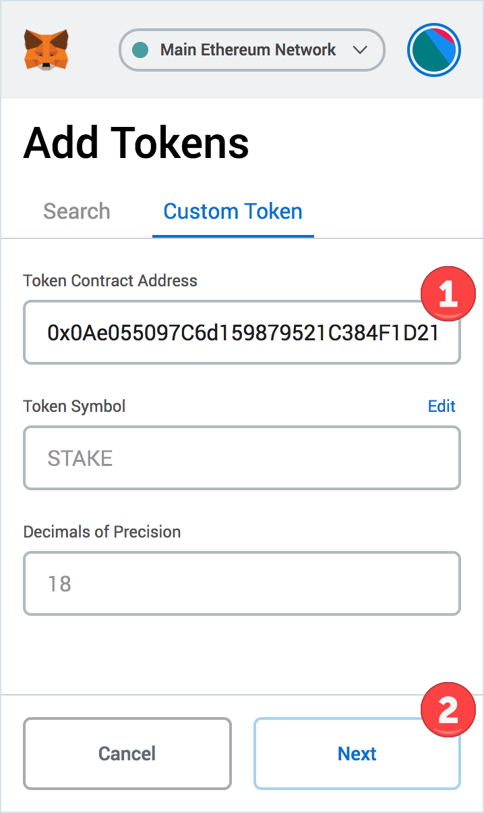
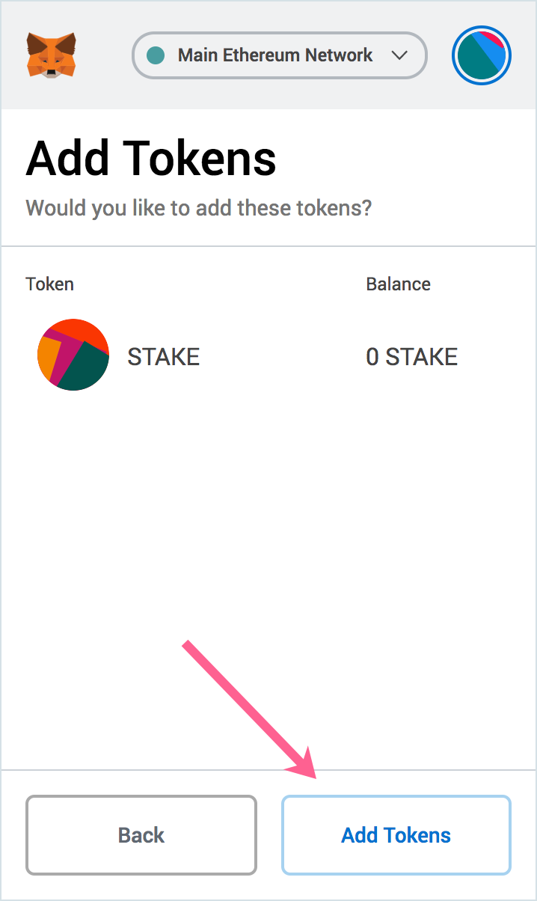
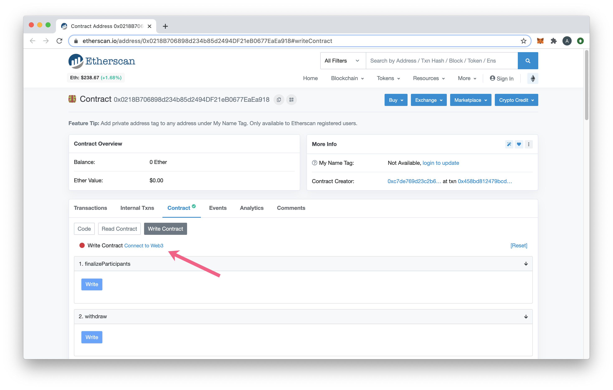
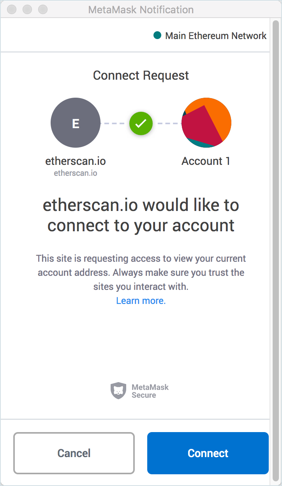
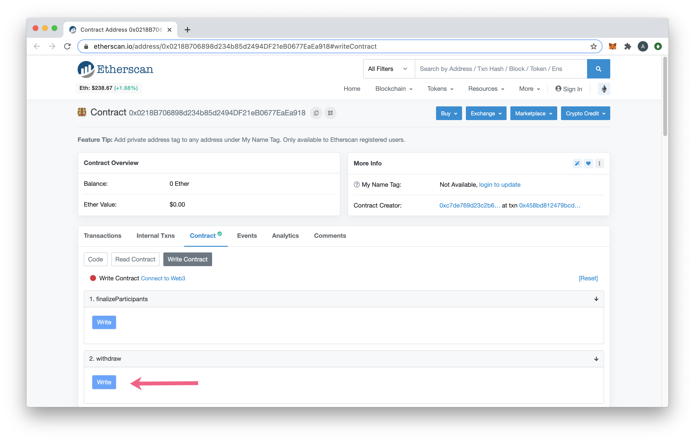
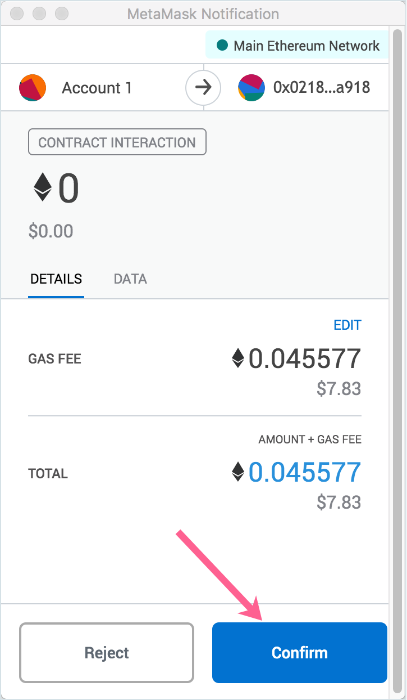
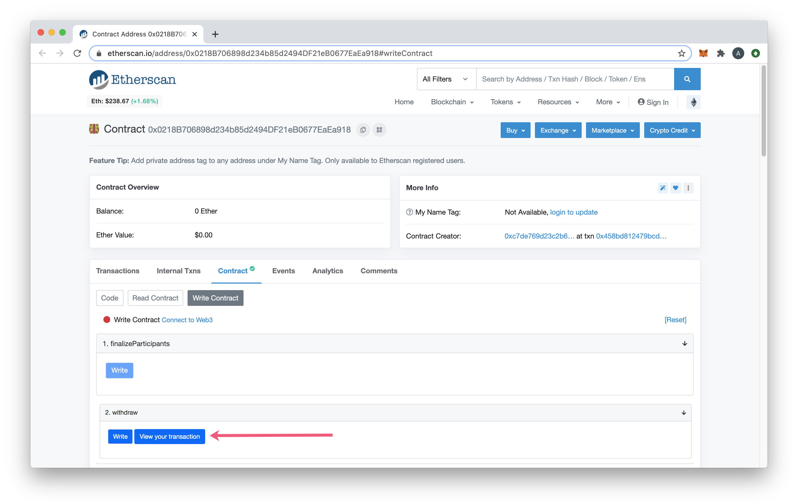
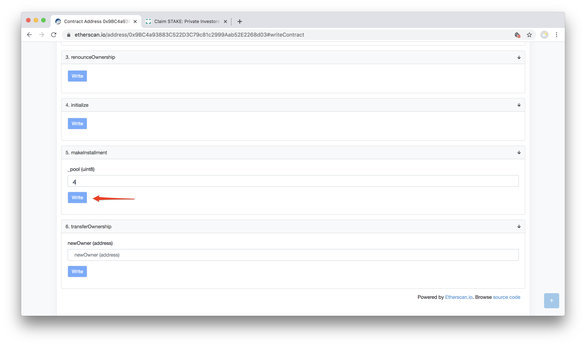

# Manual Instructions - Advisors


LATAM is only on Rinkeby testnet by now, you can ask in our discord server the release dates for Ethereum mainnet or if you are interested in participating in the private rounds or public offer [Discord Server](https://discord.gg/TncBuWdY6B), all contracts showed here may change.



LATAM token address on Ethereum [0x886714772777465613959d35C36d84bb3b5FfB0b](https://rinkeby.etherscan.io/token/0x886714772777465613959d35C36d84bb3b5FfB0b)

Advisors token contract  
[0xAcD4B247a2b74d32571F6eB63263b6eDA235f100](https://rinkeby.etherscan.io/address/0xAcD4B247a2b74d32571F6eB63263b6eDA235f100)


## Release Schedule

* Initial funds available _Pending!_ for withdrawal \(20% released\)
* New funds available each day following for the next 252 days. To transfer any available funds, you must follow the withdrawal process \(pull strategy\).


If you have already setup Metamask, skip to the [Manual Instructions](https://github.com/latam-blockchain/website/tree/aa4cbe03ed18dc72605b2e788c28cc7666804e10/latam/latam-token/get-latam/manual-instructions-advisors/README.md#manual-instructions-use-etherscan-to-transfer-latam-to-your-wallet)


## MetaMask


If using a hardware wallet to store your tokens \(Ledger, Trezor\) you can connect it to MetaMask rather than importing your account. Connecting MetaMask instructions: [https://metamask.zendesk.com/hc/en-us/articles/360020394612-How-to-connect-a-Trezor-or-Ledger-Hardware-Wallet](https://metamask.zendesk.com/hc/en-us/articles/360020394612-How-to-connect-a-Trezor-or-Ledger-Hardware-Wallet)


1\) Import your account to MetaMask. **This is the account you used to obtain LATAM as an Advisor**. You can use the private key or JSON file to import \(or Connect Hardware Wallet\).

2\) Add a small amount of ETH to your account to cover transactions \(.05 recommended\).

3\) Add the LATAM token to your wallet

a\) In Metamask click **Add token**

b\) In the **Token Contract Address** input field enter in the LATAM Token address. The remaining details will autopopulate. Click **Next**.

* LATAM Token Address: [0x886714772777465613959d35C36d84bb3b5FfB0b](https://rinkeby.etherscan.io/address/0x886714772777465613959d35C36d84bb3b5FfB0b)

c\) Click **Add Tokens** to add to your wallet view. You will have 0 LATAM tokens to start. In the next steps, you will add LATAM to your wallet.

## Manual Instructions: Use Etherscan to transfer LATAM to your wallet

4\) Go to the following address on Etherscan.  
[https://rinkeby.etherscan.io/address/0xAcD4B247a2b74d32571F6eB63263b6eDA235f100\#writeContract](https://rinkeby.etherscan.io/address/0xAcD4B247a2b74d32571F6eB63263b6eDA235f100#writeContract)

5\) Connect MetaMask. Click on **Connect to Web3** and click **Connect** on the MetaMask popup.

6\) In Etherscan, press the **Write** button next to the **withdraw** function.

7\) Confirm the transaction details in MetaMask.


**Note**: If transaction fails, see the [unlock instructions](manual-instructions-advisors.md) below


8\) Click **View your transaction** to see transaction details


Once the transaction is processed, you should see your LATAM token amount in MetaMask, and can transfer/send as you would any other ERC20 token


**If MetaMask shows that your withdrawal transaction fails, try to unlock funds first:**

### **Unlock Instructions**

_Required if allotment has not yet been unlocked_

* Go to the following address on Etherscan: [https://rinkeby.etherscan.io/address/0x5e78376F198C423CBC68F89d0D3f2BF04b610f87\#writeContract](https://rinkeby.etherscan.io/address/0x5e78376F198C423CBC68F89d0D3f2BF04b610f87#writeContract)
* Connect MetaMask. Click on **Connect to Web3** and click **Connect** on the MetaMask popup.
* In Etherscan, find **makeInstallment** point, enter in **4** in **\_pool** text box, and then press the **Write** button:

* After the **makeInstallment** transaction is processed \(confirm with MetaMask\), repeat the steps above \(starting from the step 4\) to call the **withdraw** function.

