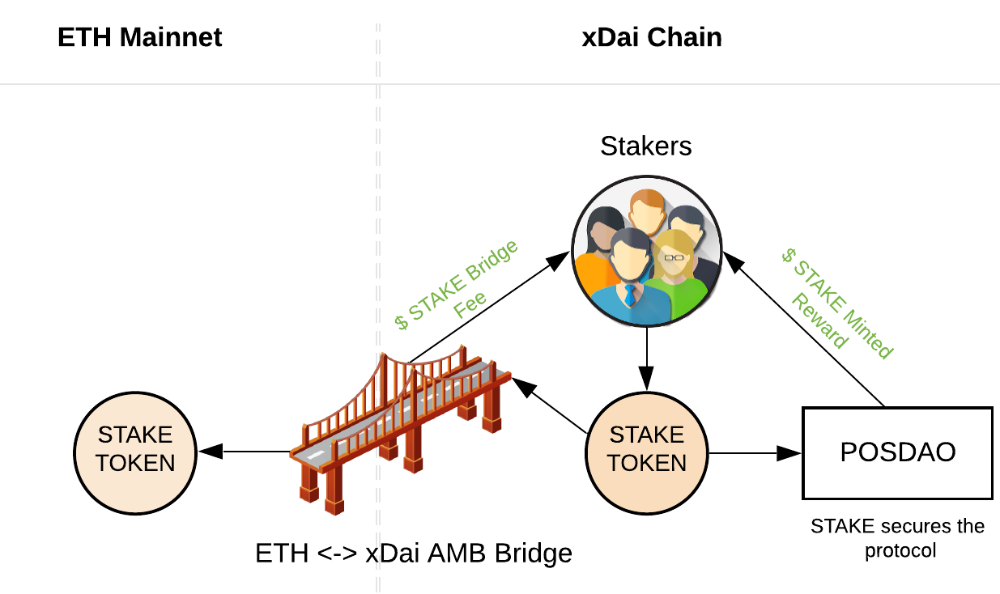

# STAKE Reward Mechanics

With public POSDAO active, validator candidates and delegators can place STAKE into the protocol. The amount of STAKE placed determines the corresponding amount of STAKE minted and distributed at the end of a staking epoch. The final emission rate is determined through a risk assessment and community input. The current target is 15% APR.

STAKE rewards may also come from bridge fees assessed when users remove STAKE from the protocol \(move it from the xDai chain to the Ethereum Mainnet\). 

## Additional Rewards

STAKE makes up the largest percentage of the staking incentive. Stakers may also receive additional rewards in the form of xDai.


The following methods are not currently active in production, but may be introduced at a later time


* **xDai rewards**.  Paid to stakers from interest accumulated from locked [CHAI](https://chai.money/).  When users convert DAI into xDAI, it is initially locked as DAI in the bridge. This locked DAI is then converted to CHAI, which earns interest on the converted amount. The interest earned during a staking epoch is distributed to stakers at the end of the epoch. 
* **TBD rewards**.  Due to the configurable nature of the protocol, additional rewards may be introduced in the future. We are researching other reward types for possible implementation.

