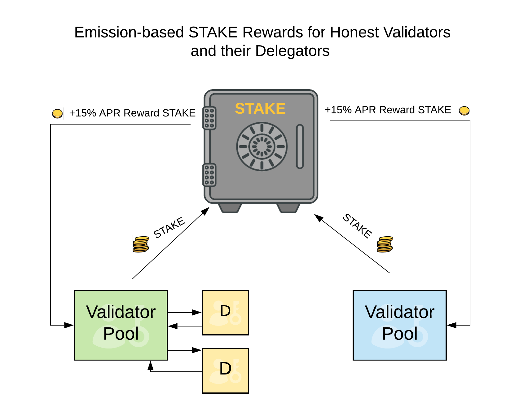

# Dual Token Model Explainer

The dual token model was created to preserve xDai's stable transactional capacity while supporting incentives for stakers \(validators & delegators\) and governance capacity for the network. 

**xDai**, the stable native coin allows users to predict fees and conduct transactions where prices will not fluctuate by large margins.  This is ideal for payments.

STAKE creates incentives for validators and their delegators though token emissions. While there is volatility with this token, it is not a transaction-based asset. Like other tokens, the price is determined by supply and demand in the Ethereum ecosystem.

<table>
  <thead>
    <tr>
      <th style="text-align:left"></th>
      <th style="text-align:left">xDai &#x2694;</th>
      <th style="text-align:left">STAKE &#x1F9B8;&#x2642;</th>
    </tr>
  </thead>
  <tbody>
    <tr>
      <td style="text-align:left"><b>Purpose</b>
      </td>
      <td style="text-align:left">Stable payments</td>
      <td style="text-align:left">
        
Staking &amp; Protocol Protection

        
Governance

      </td>
    </tr>
    <tr>
      <td style="text-align:left"><b>Stability</b>
      </td>
      <td style="text-align:left">Stable to USD</td>
      <td style="text-align:left">Volatile / Market Driven</td>
    </tr>
    <tr>
      <td style="text-align:left"><b>Availability</b>
      </td>
      <td style="text-align:left">Locked from Dai - 80M+ supply</td>
      <td style="text-align:left">Total Supply 8,537,500 + APR.<a href="../stake-token-distribution/"> See distribution for unlocks</a>.</td>
    </tr>
    <tr>
      <td style="text-align:left"><b>Trading</b>
      </td>
      <td style="text-align:left">Trade Dai on ETH Mainnet, convert to xDai through Bridge</td>
      <td style="text-align:left">Trade STAKE on ETH Mainnet, convert to xDai STAKE through Bridge</td>
    </tr>
  </tbody>
</table>

To provide block rewards, STAKE locked in the protocol accrues a 15% Annual Percentage Rate.  The block reward provides incentives for validators and delegators to continue staking. Additional rewards are also provided through separate mechanisms. See [rewards in a dual token environment](rewards-in-a-dual-token-environment.md) for more details.

