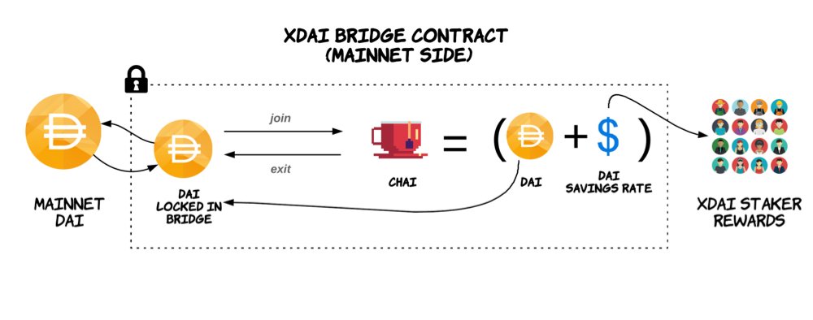

# Chai FAQs


Update October 08 2020: Chai conversion has been disabled through a governance vote. It was costing extra fees for users and the savings rate was set to 0 for a prolonged period. The governors may revisit at a later time or look to introduce another mechanism for incentivization.  
  
[Proposal and Decision](https://forum.poa.network/t/disable-chai-token-support-to-safe-gas-for-deposit-and-withdrawal-operations/3936)


## What is Chai?

Chai is an ERC20 token that earns token holders interest on Dai without needing to lock it in the Dai Savings Contract. Dai is converted to Chai, and the Chai balance remains constant, while the Dai value grows with the [Dai Savings Rate \(DSR](https://community-development.makerdao.com/makerdao-mcd-faqs/faqs/dsr)\).  At any time, Chai can be converted back to Dai along with any accumulated interest. [Learn more here](https://chai.money/about.html). 

## How is Dai converted to Chai?

Dai is converted to Chai by calling the `join` function. This function is called by a bridge oracle when Dai is locked in the bridge contract, and the locked Dai is converted to Chai.

The current amount of locked Dai in the protocol \(~40K Dai\) will be converted to Chai when the first token transfer is initiated following the protocol upgrade.

Chai is converted to Dai by calling the `exit` function. When a user exits the protocol \(transfers xDai into Dai\), this method is called and Chai is swapped for Dai.

## Is all of the Dai in the contract converted to Chai?

Almost all - a small amount of Dai \(100 Dai\) is not converted. This amount is maintained in the bridge to supplement gas costs \(for Chai-to-Dai operations\) when small transactions are relayed from xDai to Dai.  

## What changes will happen from a user / contract call perspective when transferring Dai to xDai / xDai to Dai?

Users should notice no difference in operations, and no changes need to be made for contracts interacting with xDai. These operations occur behind the scenes and will not impact the user experience.

## Who receives the additional earned interest?

Initially, the earned interest will be sent to one of the bridge validators. Currently, the DSR is very low resulting in a minor accumulation. There are plans to redistribute this amount once phase 2 of POSDAO begins \(public staking and delegation\).  The methodology for this distribution is TBD.

In phase 2, interest will be distributed to stakers in the protocol. A contract will send interest to the xDai consensus contracts to distribute interest in xDai to all staking participants. A method called [`payInterest`](https://github.com/poanetwork/tokenbridge-contracts/blob/6fecdbc6b0d1edba3baeb8a4481d039ebd5554c4/contracts/upgradeable_contracts/ChaiConnector.sol#L157) will be called to initiate the distribution.

## Security Disclaimer

While the underlying TokenBridge functionality has undergone several comprehensive [security audits](https://docs.tokenbridge.net/about-tokenbridge/security-audits), the specific Dai-Chai conversion functionality has not undergone an official 3rd party audit. It has been reviewed internally by the POA R&D team. In addition, the Chai contracts have undergone a [security review](https://chai.money/Trail_Of_Bits-Letter_of_Attestation_Chai.pdf) by Trail of Bits.

