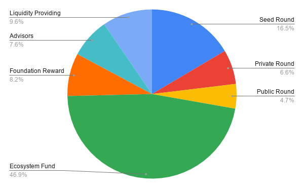

# STAKE Token Distribution

The STAKE token has an initial circulating supply of 8,537,500. Additional STAKE tokens are minted as staking rewards \(15% of staked tokens\).

| Distribution Type | Amount | Initial Lock | Distribution Schedule |
| :--- | :--- | :--- | :--- |
| Private Seed Round | 1,408,451 | Partial | 25% released at listing, 10% at day 28, remaining 65% distributed during the next 224 days |
| Private Offering Round | 562,500 | Partial | 25% released at listing, 10% at day 28, remaining 65% distributed during the next 224 days |
| Public Offering | 400,000 | No | 100% released at listing |
| Liquidity Fund  | 816,500 | No | 100% at listing. Used to foster global liquidity.  |
| Ecosystem Fund | 4,000,000 | Yes | Begins 336 days post listing, continues daily for 336 days.  |
| Foundation Reward | 699,049 | Yes | Begins 84 days post listing, continues daily for 252 days |
| Advisors Reward | 651,000 | Yes | Begins 84 days post listing, continues daily for 252 days |
| Staking Rewards | TBD | Yes | Begins 84 days post listing \(at start of POSDAO protocol\) |
| Total Supply | 8,537,500 |  |  |

### 

