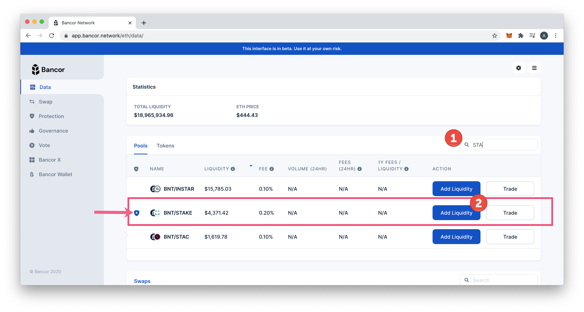
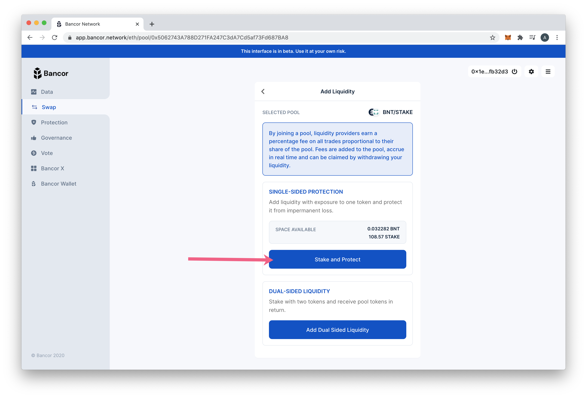
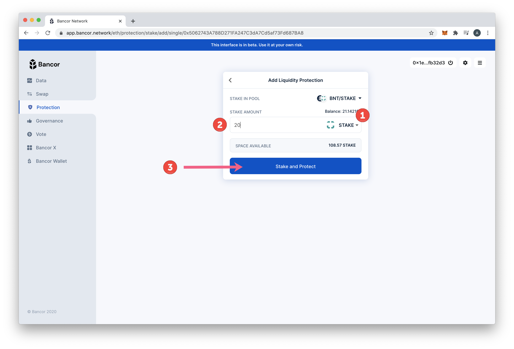
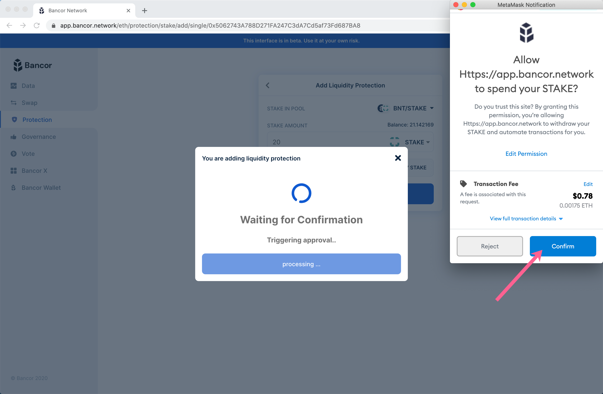
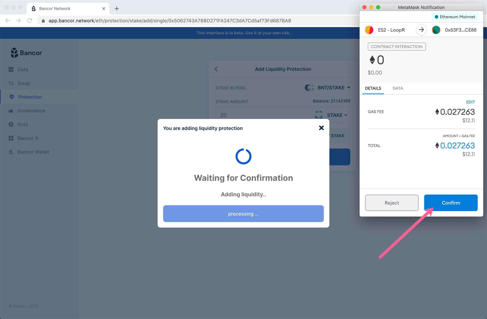
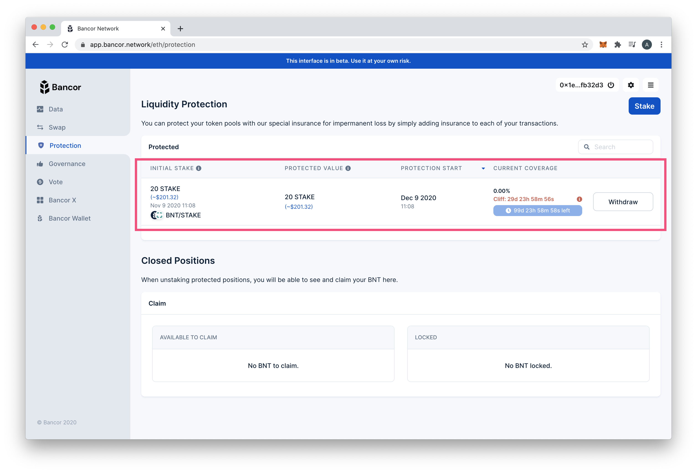

# Bancor 2.1 Single-Sided Staking

The STAKE token is now whitelisted on Bancor v2.1. This means participants can participate in single-sided staking to earn swap fees while staking with a single asset. Below, we show you how to stake with STAKE and receive protection against [impermanent loss](https://blog.bancor.network/beginners-guide-to-getting-rekt-by-impermanent-loss-7c9510cb2f22) over time.

🙋♂ [More on single-sided staking on Bancor](https://blog.bancor.network/guide-single-sided-amm-staking-on-bancor-v2-1-93e6839959ba)

### 1\) Go to [bancor.network](https://bancor.network) and connect your web3wallet \(such as MetaMask\). 

Once Connected:

1. Search for **STAKE**.
2. Click **Add Liquidity**.


A blue shied indicates a whitelisted pool -  a pool available for single-sided staking.


### 2\)  Select **Stake and Protect** to add single token Liquidity.

There are 2 options to add liquidity, Stake and Protect, or Dual Sided Liquidity. In this example we will retain 100% exposure to STAKE.

### 3\) Add liquidity details.

1. Select **STAKE** from the dropdown.
2. Enter amount to stake.
3. Click **Stake and Protect**.

### 4\) Confirm 2 transactions.

The first will grant permissions to the Bancor contract to spend your STAKE, the second will process and pay for the transaction.

### 5\) STAKE liquidity is now protected.

Your protected STAKE will now appear in the [Protection screen](https://app.bancor.network/eth/protection),\(refresh if needed\) where you can manage your liquidity. 

Compare Protected Value to Initial Stake to see accrued value in swap fees over time.


Current Coverage protection increases over time, and starts at 0 for the first 30 days \(the cliff\). When the cliff is reached, you are entitled to 30% coverage. Coverage increases by 1% per day until 100% coverage is reached \(full protection\).


