# Loopring Pay

[Loopring](https://loopring.io/) is a 3rd party ZK rollup provider for trading and asset transfer.  The Loopring Pay platform provides secure, decentralized, free trading and transfer ability. There are initial costs \(gas fees\) to sign-up for the platform and make deposits and withdrawals, however, once you are in the system transfers between Loopring accounts are fast and free.

**STAKE is now available for transfer with Loopring Pay**. Trading is not currently enabled.

1\) To get started, go to loopring.io and click connect wallet. Choose the wallet you will use to connect.

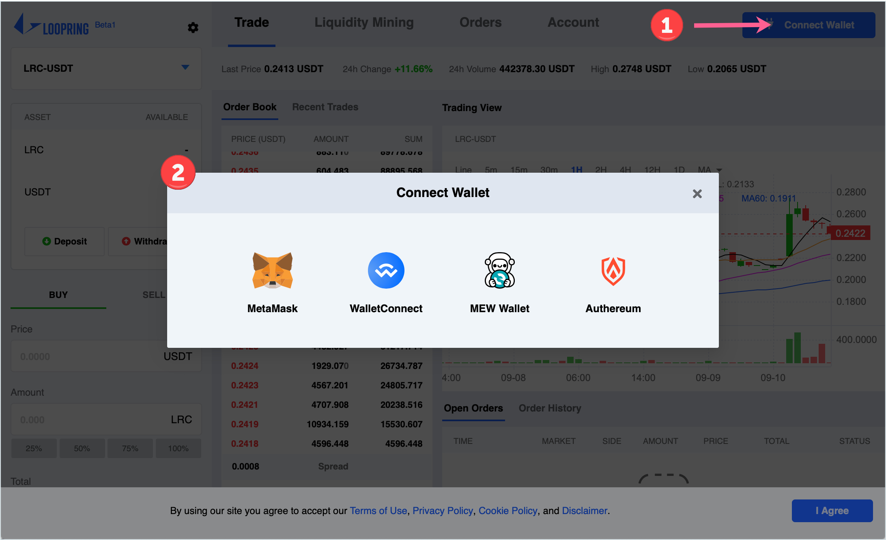

2\) Click login to continue.

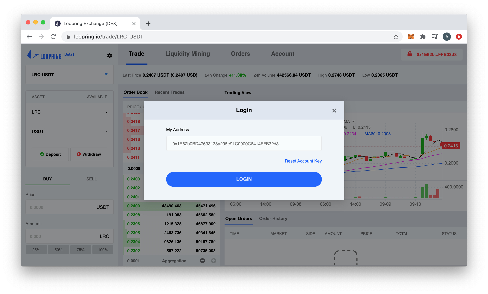

3\) Next, you will register your address with Loopring. This takes some time and gas fees to process. Select **Register Account** from the connected address dropdown.

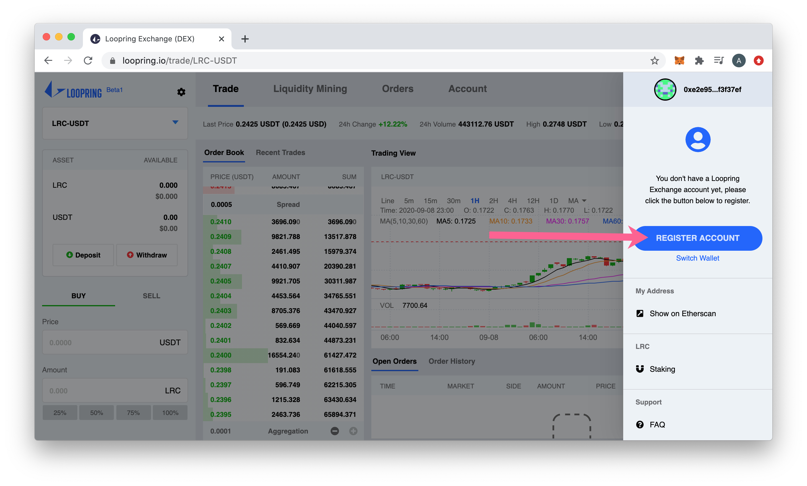

4\) Click the Register Account button.

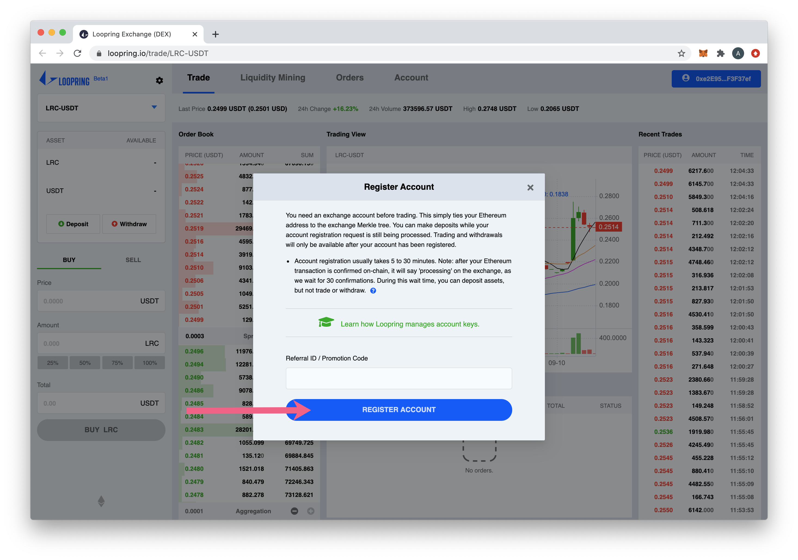

5\) Sign the signature request with your wallet \(demo uses MetaMask\).

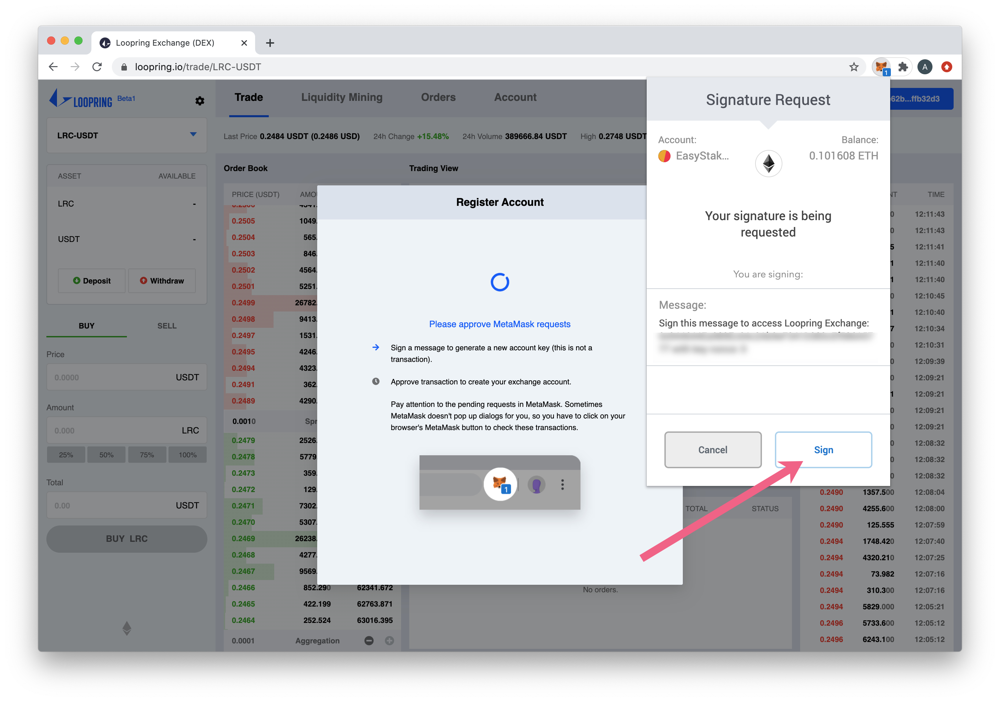

6\) Confirm the transaction.

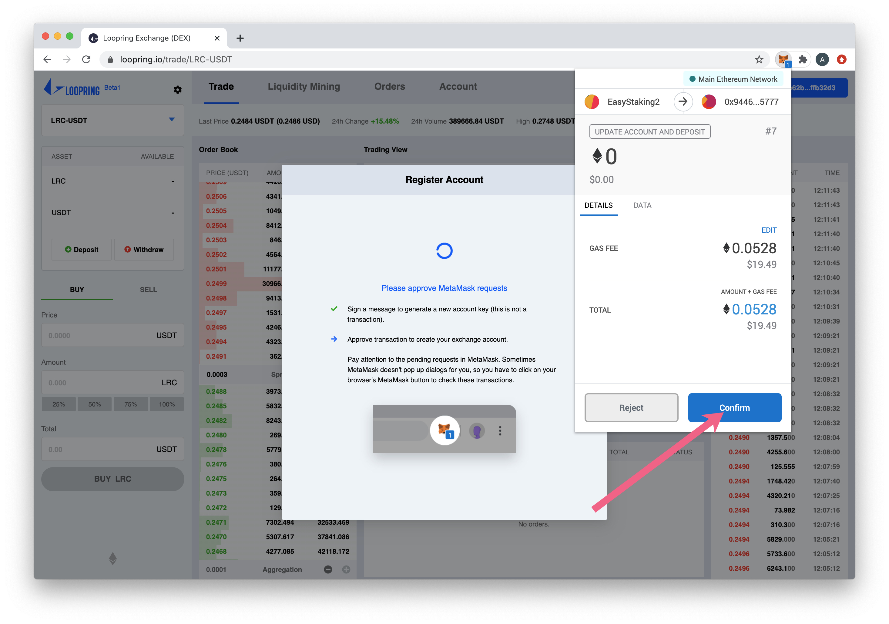

7\) You can add a deposite while the registration is processing \(it can take 5-30 mins\). Click on your connected address to see the dropdown. Press the **Deposit** button.

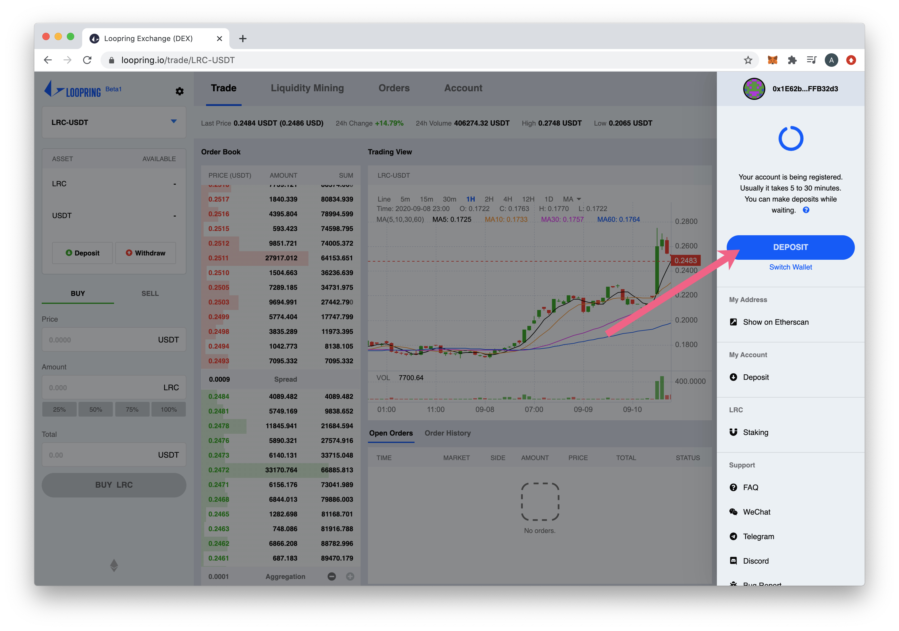

7\) In the pop-up, select STAKE from the Asset dropdown, enter the deposit amount, and press **Deposit**.

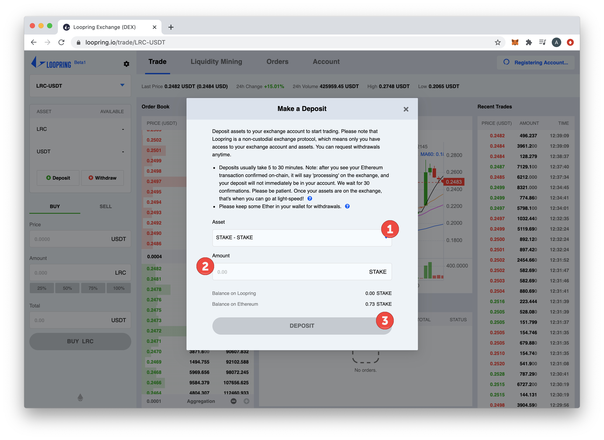

8\) **Confirm** the deposit transaction.

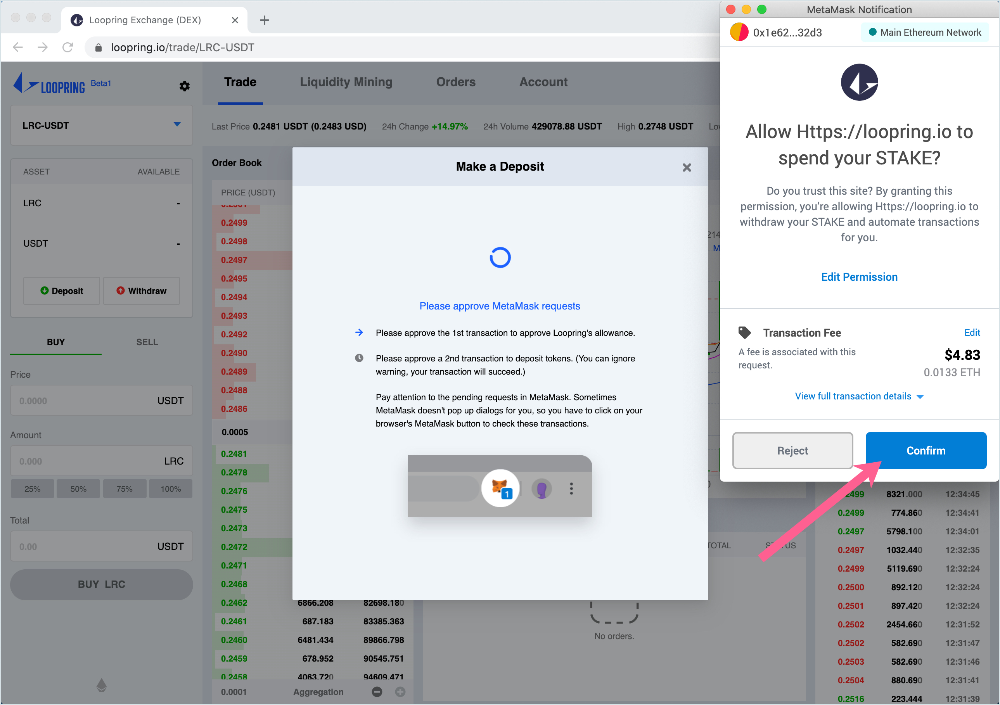

9\) Wait for the deposit to register with Loopring. This can take between 5-30 minutes. Once it arrives, transfers to other registered addresses will be very fast and free. After the deposit is confirmed, click **Transfer** in the address dropdown menu.

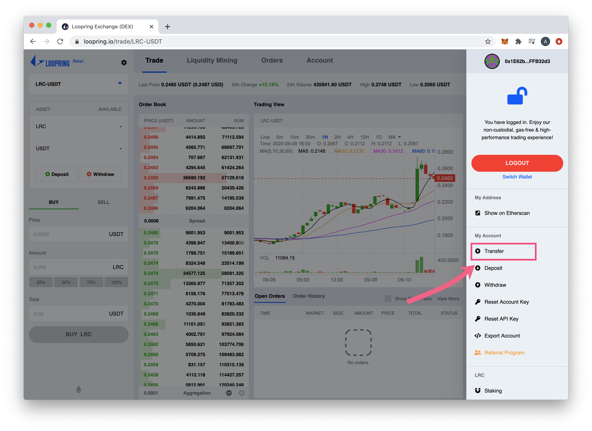

10\) Enter the following:

1. Choose STAKE from the Asset dropdown.
2. Enter a hexidecimal address or ENS of recipient. **Recipient must also be signed up with Loopring.**
3. Enter amount to send, can be any portion of your deposit.
4. Optional Note.
5. Press **Transfer.**

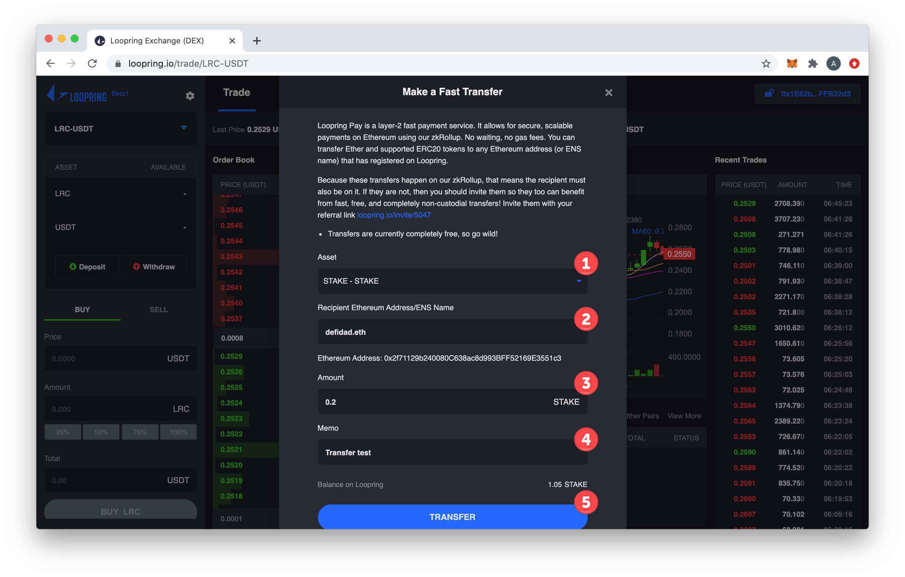

11\) Sign the transaction in your wallet. There are no fees associated with the transfer, a signature is required to process.

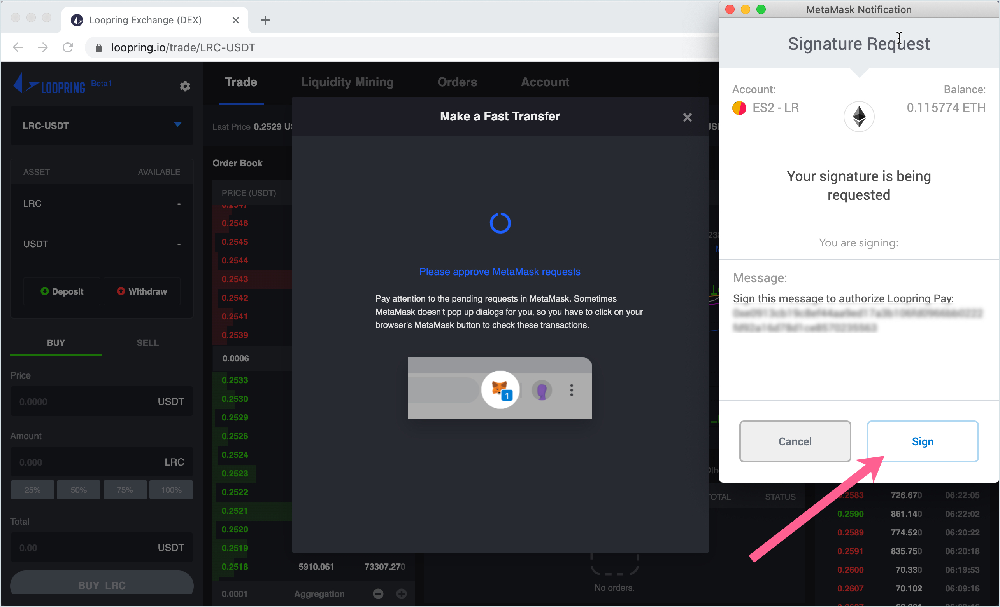

12\) The transfer will happen in just a few seconds. To check your transfers, go to **Account -&gt; Transfers** in the top menu. You can also view balances \(and transfer directly from the Balances screen if desired\).

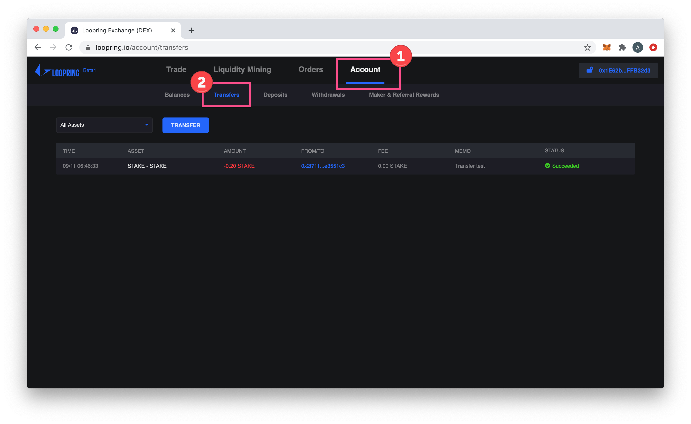

