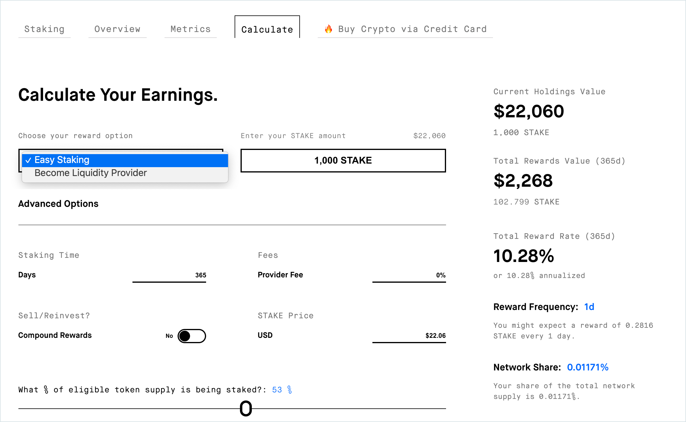

# Staking Rewards

[Staking Rewards](https://www.stakingrewards.com/earn/xdai) offers up-to-date information about STAKE. This includes a historical overview of price and market cap, balance and circulating supply information, and an advanced calculator.

To use the calculator, go to [https://www.stakingrewards.com/earn/xdai/calculate](https://www.stakingrewards.com/earn/xdai/calculate).

Chose your reward option and enter the amount you will stake.

Next you can change other parameters including the amount of time and amount staked in the protocol. Rewards will adjust to show your total reward rate along with the associated annualized rate.

### 

