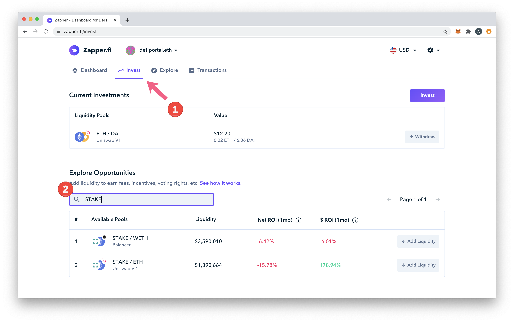
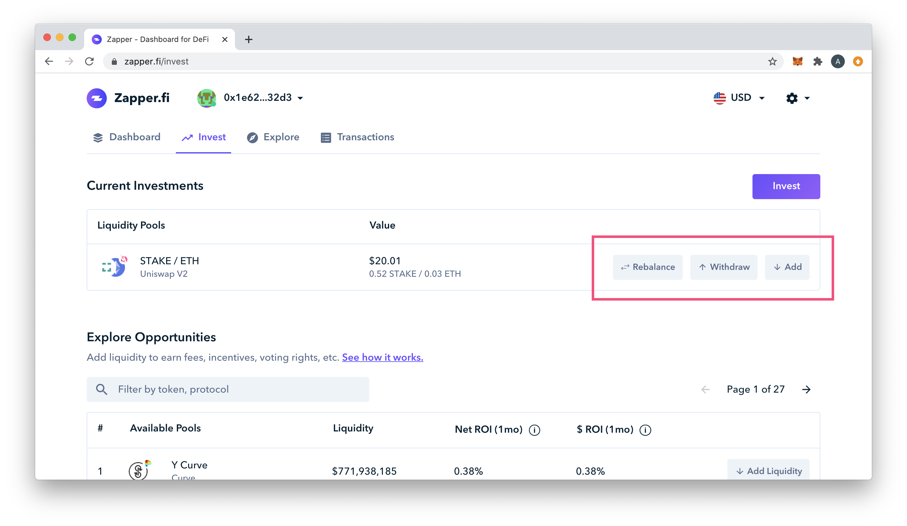
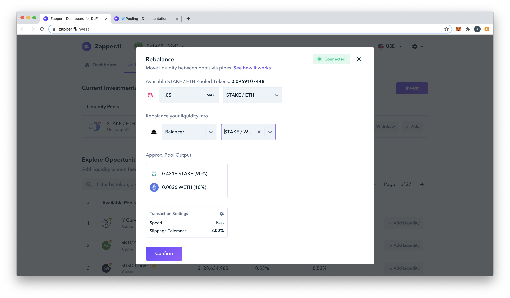
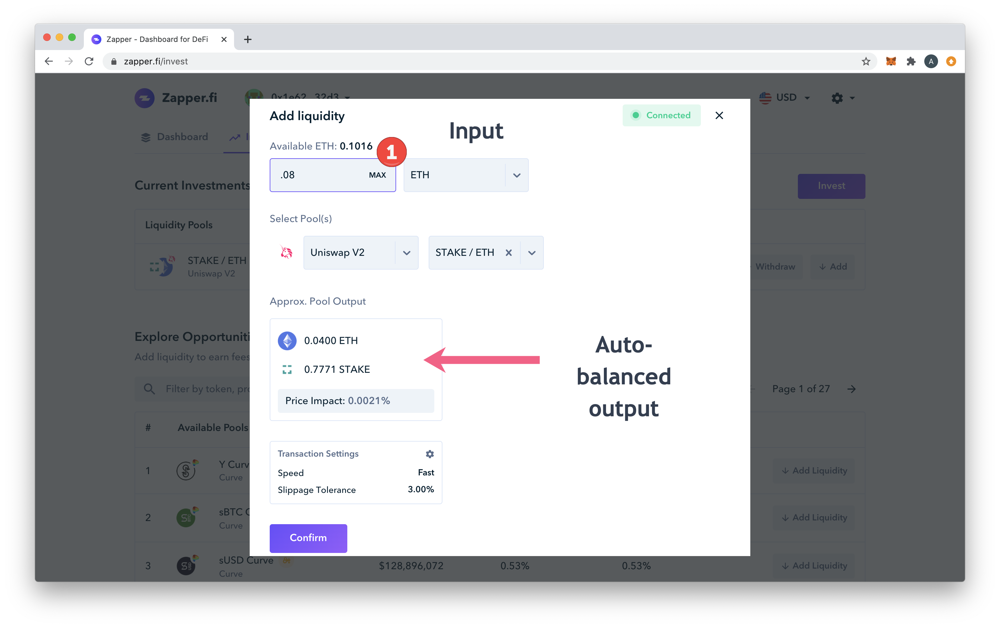
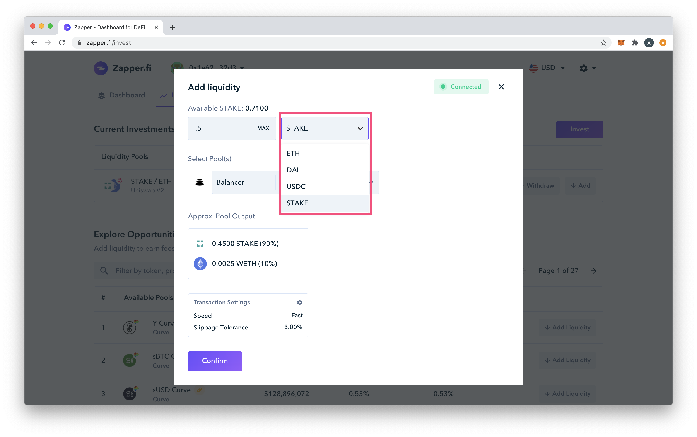

# Zapper

The Zapper Dashboard is really helpful for organizing DeFi investments, especially with all of the protocols, platforms and other instruments you may be using within the DeFi ecosystem.

You will connect your wallet to the application at [https://zapper.fi/](https://zapper.fi/) to start. You can also login with the defiportal.eth ENS to get an idea of all of the dashboard and how it might work for you. For more on Zapper and all you can accomplish, please see the [Zapper docs](https://docs.zapper.fi/).

1\) To access STAKE liquidity pools, go to Invest and Filter by STAKE in the Explore Opportunities search box.

2\) Click on a STAKE pool in the list to add funds for the first time. If you are already participating in a pool, you will see your current amount and can Rebalance, Withdraw or Add to the pool from the Zapper app.

3\) In the Rebalance window you can move your funds to a different pool.

4\) When adding assets, the application automatically adjusts the balance. With the Balancer pool, you can add USDC, DAI or ETH and it will automatically convert it to STAKE/ETH!

  

