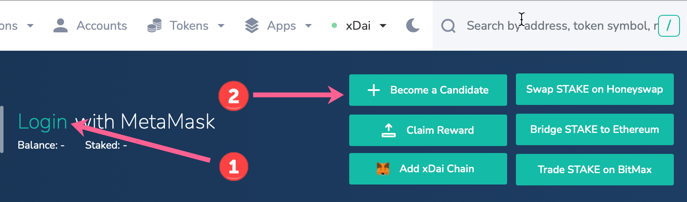
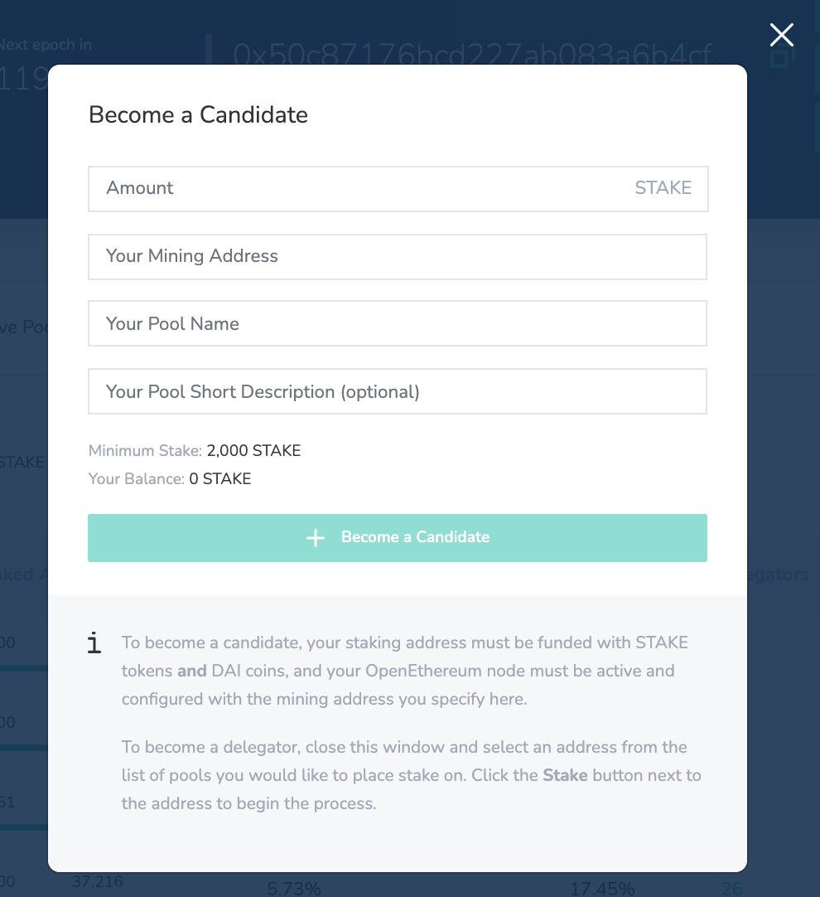

# Become a Candidate / Validator

Validators are responsible for securing Latam-Blockchain. Validator responsibilities include maintaining a functional node with constant uptime, providing LATAM as collateral, and providing decentralization to the protocol. In exchange for this service, validators receive block rewards and transaction fees \(_As chain usage grows, these fees may be redirected to support additional aspects of the protocol\)_. 

To become a validator on Latam-Blockchain, you must first become a candidate. Each staking epoch, 19 candidate pools are chosen to act as validators for that epoch. If there are 19 or fewer active candidates, then all active pools are selected. If there are more than 19, selection is based on total stake in the pool + a random number. [See this article from POA team for more info on weighting and randomness](https://forum.poa.network/t/reliable-randomness-bringing-on-chain-entropy-to-the-xdai-stable-chain/3015).


If you do not want to become a validator, but are interested in placing stake on other validators, see [Become a Delegator](become-a-delegator.md).


## Instructions


If you have any questions or concerns about becoming a candidate or validator, or experience any issues during setup, please contact us in [Discord](https://discord.gg/mPJ9zkq) in the validator-candidates channel.



**It is best to start this process at the beginning of a new staking epoch**, as it gives you a week to fund your candidate address and setup your node correctly.


1\) Create \(or use addresses you have access to\) 2 Ethereum addresses. One will be used for **mining**, and a second for **staking**. Addresses are the same on Latam-Blockchain & Ethereum, so can be generated in a normal manner.


Do not use addresses previously used with POSDAO. For example, you cannot create a candidate pool with a staking address previously used to delegate  on other pools. 


2\) You will need the minimum candidate stake amount of LATAM \(2,000 LATAM\) on Latam-Blockchain and a small amount of USD deposited to your address on Latam-Blockchain. Deposit these to **your staking address** \(an 0x external address\). You will use to access the protocol. 

3\) In addition to your regular staking address, you will need a **separate mining address.** This ****will be configured to an OpenEthereum or Nethermind node. Generate and save the JSON keystore file \(and be sure to save the password in a safe place!\) See below to generate keystore, or use [MEW](https://kb.myetherwallet.com/en/security-and-privacy/what-is-a-keystore-file/) or [MyCrypto](https://support.mycrypto.com/).

* * You can generate a key with the following OpenEthereum's CLI command or use the You use the [`eth-keygen-json`](https://www.npmjs.com/package/eth-keygen-json)  tool made by [Peppersec.com](https://peppersec.com/).

```text
openethereum account new --keys-path <path_to_save_json_keystore>
```

4\) Once your staking address is funded and your mining address is created, go to [BlockScout staking app](https://explorer.latam-blockchain.com/validators).


5\) Connect your web3wallet \(Metamask/Nifty\) to Latam-Blockchain with your **Staking Address**

1. Login to the Staking App in BlockScout. Once connected, you should see your address and LATAM balance in the site banner. If you are a delegator, you will also see information related to any LATAM already in use \(staked or ordered for withdrawal\).
2. Click the **Become a Candidate** button**.**



6\)  A modal will appear where you enter the amount of your initial LATAM \(2,000 minimum - you can add more now as well or more at a later time \) and the **mining address of your node**.  You will also enter the Pool Name and Short Description \(optional\) which will be displayed in the staking interface.




If you are trying to become a candidate at the end of an epoch, you may see the Actions temporarily disallowed popup. Wait until the next epoch begins to start the process.


7\) Once you've filled the information in the modal, click **Become a Candidate**. Submit and complete the transaction through the web3 wallet interface using your staking address.

8\) If successful, your pool will appear in the **Active Pools** tab of the staking Dapp. You will be eligible to join the next staking epoch.

9\) Let the team know you are an active candidate in the [discord channel for validator candidates](https://discord.gg/mPJ9zkq). They will provide you with additional information to setup your mining node correctly. 

10\) Setup your node following instructions from the New Validator Process Flow Section for the client you will use.

* [Nethermind](../../for-validators/new-validator-process-flow/nethermind-node-setup.md) \(recommended\)
* [OpenEthereum](../../for-validators/new-validator-process-flow/openethereum-node-instructions.md)


**We recommend running** [**Nethermind**](../../for-validators/new-validator-process-flow/nethermind-node-setup.md) ****as OE may be deprecated in the future. If you decide to stay with OE use version 3.2.5+ 


