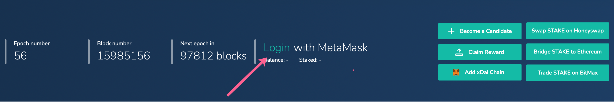
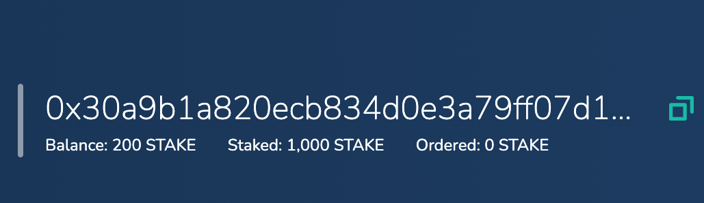
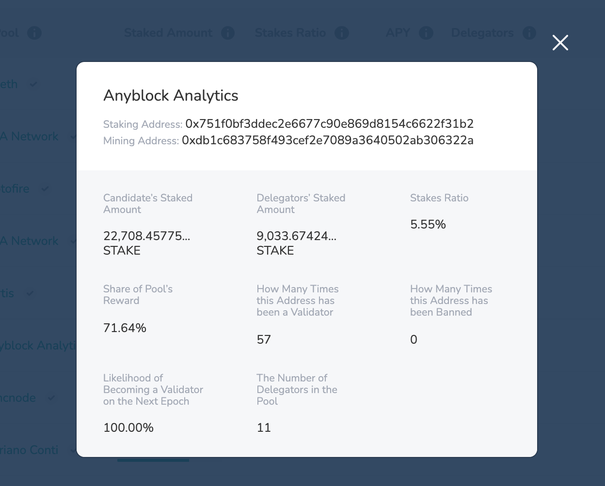
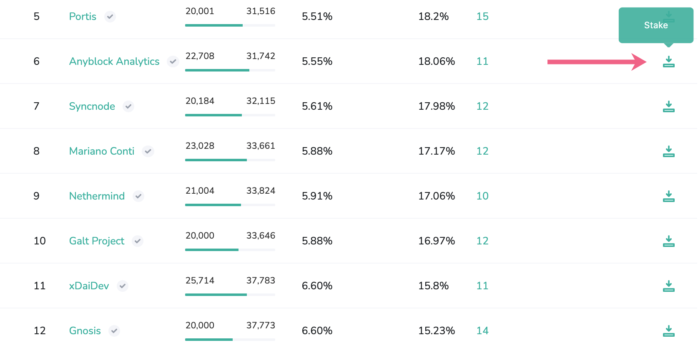

# Become a Delegator

Delegators play an important role in securing the network. By placing stake on candidates, delegators provide additional funds which improve a candidate’s likelihood of becoming a validator. Stake can be thought of as a “vote” in the form of LATAM tokens for a candidate.

Delegators can place stake on multiple candidates, move stake between active candidates, and order stake withdrawals during a staking epoch. Block rewards for delegators are based on the percentage of stake they place in the pool. 

While each validator pool receives the same reward during a staking epoch, rewards within a pool are split between the validators and delegators. This split is based on how much LATAM a delegator has placed relative to the total pool stake. The reward percent is updated each staking epoch in the Delegators modal, which is accessed by clicking on the number of Delegators for any Pool.

To start you will need **200 LATAM on Latam-Blockchain**.

## **Delegating LATAM**

1\) You will need the minimum delegator stake amount of LATAM, currently 200 LATAM and a small amount of USD \(0.1 is plenty\) deposited to your address on Latam-Blockchain.

* [Get USD](../../for-users/getting-started-with-latam-blockchain.md#2-get-a-little-usd)
* Get [LATAM on Latam-Blockchain](../latam-token/get-latam/)

2\) Go to [block explorer](http://explorer.latam-blockchain.com) , change the network to Latam-Blockchain in Metamask, and click Login. Be sure you are connected to the account address you want use for transactions.

3\) Once connected, you should see your address and LATAM balance in the site banner.

5\) Find a candidate pool you would like to place stake on. You can view **current validator pools** on the **Validators Tab**, and **all active pools** in the **Active Pools \(Candidates\)Tab**. This tab includes validators as well as pools which are not currently validating but are eligible to become validators. 

Click on the pool address to see current pool statistics to help guide your decision. 

Staking into a candidate with a smaller pool size can result in higher reward percentages, however, candidates with smaller pools have a lower likelihood of selection to the validator set \(assuming 20+ active pools\). Stake on the candidate\(s\) you believe will provide the most benefits for the network; this will benefit you as well. You can also learn more about validators at [https://dai-netstat.poa.network/ TODO](https://dai-netstat.poa.network/)

6\) Once decided, click the stake icon next to the pool you would like to stake on.

7\) Enter the LATAM amount to stake. The minimum initial stake is 200. Click the **Place Stake** button to submit your transaction.

8\) You should see the transaction pop-up for your web3 wallet. Transaction fees do not need to change \(although you can set gas price to 1 gwei\). Click **submit** to process.

9\) Wait a moment for successful processing. Once confirmed, you will see the Success modal. Click OK.

10\) Your stake will be added to the pool. **It will not be activated until the next staking epoch**. This means you can move or withdraw your stake freely until the staking window closes, which occurs at the end of the current staking epoch.

11\) To view your stake amount and reward percentage, click on the number of delegators. Your address will be marked with **ME**.

12\) If the pool you delegate to is selected as a validator for the next validator set, your LATAM will accrue rewards. Rewards are accrued to contract's balance and can be claimed with **Claim Reward** feature.

13\) While your delegator stake is active \(in use by a current validator pool\), it cannot be withdrawn immediately. However, you can:

1. **Add Additional Stake**: Any additional stake added during an epoch will not accrue rewards for the current epoch, but will be added to the pool size which will influence selection in the next epoch. If the pool is chosen as a validator again, this added stake will be included in the next epoch’s rewards calculations.  

   \*\*\*\*💎 **Instructions** To add additional stake on a candidate or validator, click the stake icon and enter the additional amount. You can add in any increment, as long as the total stake is more than a minimal required amount. Follow the web3 wallet prompts to complete the transaction. [More Info](staking-operations/add-stake.md)  

2. **Order Stake for Withdrawal**. You may order a withdrawal of your stake, which will be available after the current epoch ends. Ordering a withdrawal will also influence total pool size for the next epoch’s selection process.To order a withdrawal, click the withdrawal icon and enter the amount to order. You must either keep the minimum delegation stake amount OR order the entire amount for withdrawal. You cannot have an amount below the minimum, but you may withdraw your total amount.  

   \*\*\*\*💎 **Instructions** Enter the amount and click Order Withdrawal. You can enter the whole amount to remove yourself as a delegator, or you can remove a portion as long as you maintain a minimum of 1000 LATAM.The transaction should process through the web3 wallet interface. Once the staking epoch is complete, the amount will be available to claim. Click on the claim icon and follow the instructions. [More Info](staking-operations/withdraw-stake.md#ordered-withdrawal)

