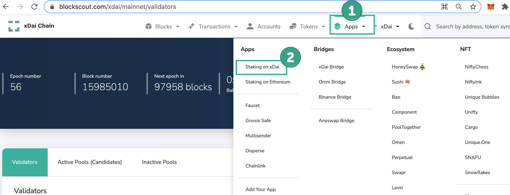
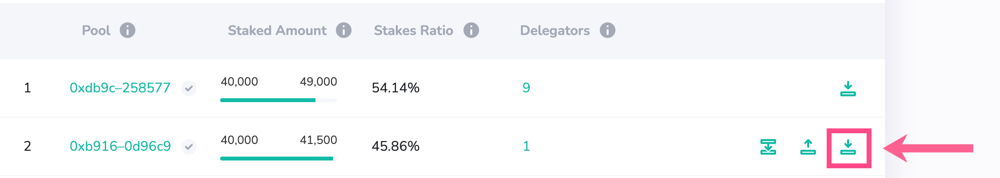
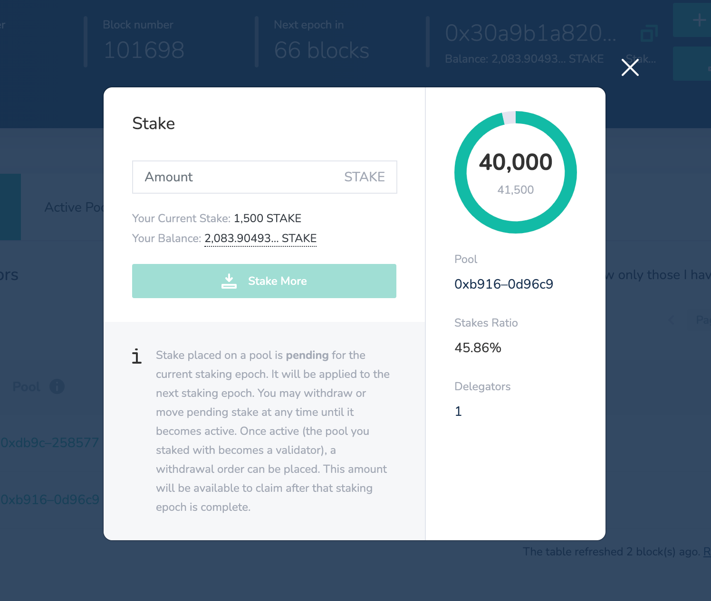

# Add Stake



To add stake for the first time, you can either [Become a Candidate](../become-a-candidate-validator.md) or [Become a Delegator](../become-a-delegator.md), depending on whether you want to create your own pool \(become a candidate\) or stake into an existing pool \(become a delegator\).

**Add More Stake:**

1\) Ensure you have LATAM on Latam-Blockchain and a small amount of USD to complete a transaction. Once you have become a candidate or delegator, you can stake any amount, as long as the total remains above the minimum LATAM amount.

2\) To add, click on the stake icon 

A modal will appear with information about the pool on the right, and your balance and token information on the left. You will see your current stake amount as well as your balance information. 

3\) Enter in the amount you would like to stake and click **Stake More** _\(if you have not staked into this previously, the button will say Place Stake and you can follow the_ [_Become a Delegator process_](../become-a-delegator.md)_\)._ You can add additional pending stake in any amount to the pool at any time, and it will be active in the next staking epoch.

4\) Assuming your stake amount is valid \(you have sufficient funds, your stake per pool is above the minimum requirements etc.\), you will be directed to complete the transaction using the web3 wallet interface.

5\) Once you have placed or added stake, you can [move pending stake to another pool](move-stake.md) or [withdraw pending stake](withdraw-stake.md) at any time during the current staking epoch\*. When the epoch concludes, a new validators set is chosen.

1. If the pool you placed stake on becomes a validator pool, then this stake is committed to the protocol for the next epoch. You will earn rewards based on your percentage of stake in the pool. You cannot withdraw this stake immediately, but can order for withdrawal. This request will be processed at the end of the current epoch, and funds will be available after the current staking epoch ends.
2. If the pool you placed stake on is not chosen as a validator pool, you can withdraw or move your funds at any time\* during the next epoch.


\*You cannot add, move or withdraw stake when the staking window is closed. This occurs at the very end of each staking epoch, where all staking actions are inactive. 


