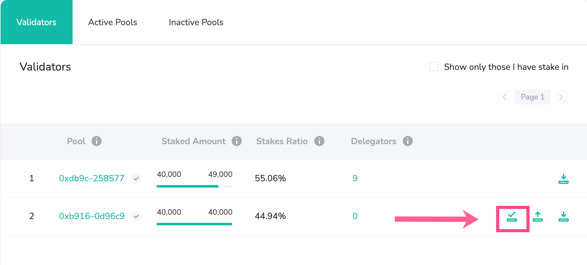
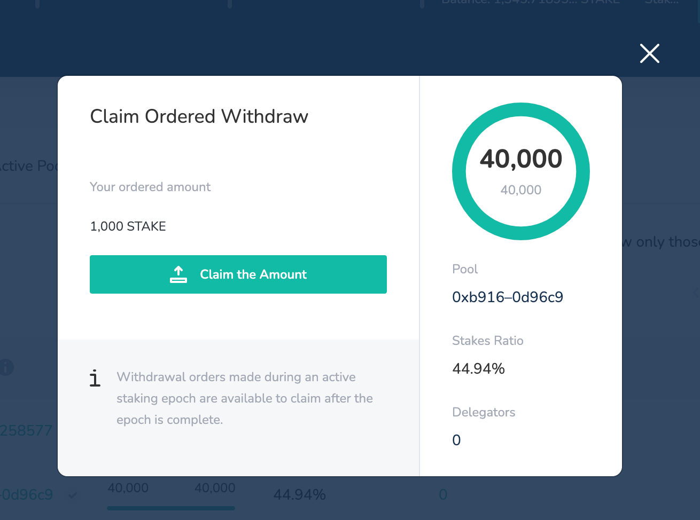

# Claim LATAM Stake

## Claim LATAM stake Rewards

Rewards are available to claim once a staking epoch is complete. If your stake was active during previous epochs you can claim using the Claim Button in BlockScout. 


If you receive an error when claiming, try to specify separate epochs, the **Tx Gas Limit** may be too high to process all epochs at once.


## Claim Ordered Withdrawals



Stake ordered for withdrawal is available to claim once the staking epoch in which the claim was ordered is complete. See the **important note below** related to actions that can cause a claim delay.

1. Check that your web3 wallet is connected with the correct address and you have enough USD to process the transaction. 
2. Click the Claim icon next to the pool you would like to claim your stake from. The icon will only appear once a claim is available.  

3. The modal will show the amount available to claim. Click the **Claim the Amount** button.  

4. Confirm the transaction with your web3 wallet. The claimed amount will be added to your address balance.


**Important:** If you place a withdrawal order in a staking epoch **before claiming your previously ordered amount**, your initial claim will be carried over and added to the new order, so that **no amount will be available to claim from that pool until the beginning of the next staking epoch**.


**For example:**

* **Staking epoch 100:** 5 LATAM ordered for withdrawal.
* **Staking epoch 101:** 5 LATAM is available to claim. However, you place another order withdrawal for 7 LATAM before claiming the available 5 LATAM. The total ordered for withdrawal from the pool is now 12 LATAM. This new amount will be available in the next staking epochs.
* **Staking epoch 102:** 12 LATAM available to claim. This claim will continue to be available in subsequent staking epochs as long as another withdrawal order is not placed, which will delay claiming until the next staking epoch.

