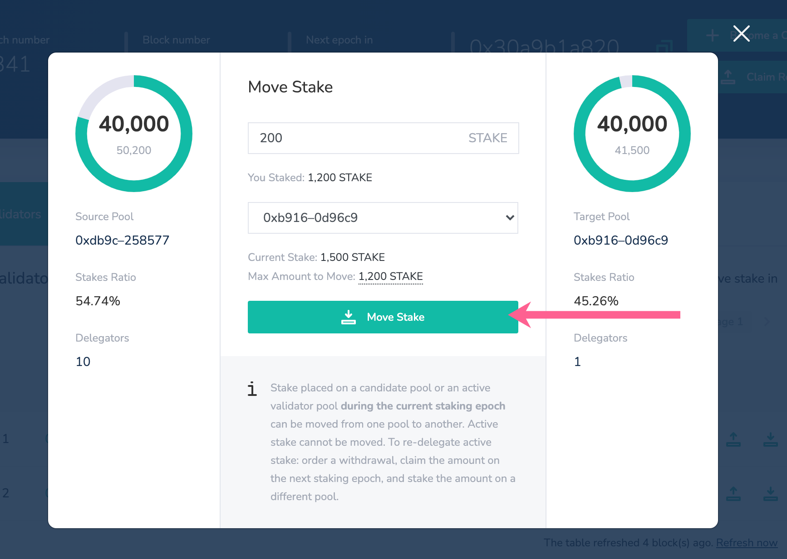

# Move LATAM Stake

LATAM Stake can be moved to change which candidate you are delegating to, or to spread your LATAM to different validator pools. 

You must either retain the minimum amount of LATAM stake in the pool \(to remain in the pool\), or move the entire amount. This will cause you to exit the current source pool and shift your stake to a new target pool. 

### **When Stake can be Moved:**

* LATAM placed on an **active candidate pool who is not a current validator**, or LATAM placed on **an inactive candidate pool,** can be moved at any time.\*
* LATAM placed on an active validator pool can be moved **during the same staking epoch in which it was placed**. It cannot be moved once it is active protecting the protocol.
* LATAM stake cannot be moved or withdrawn from a banned pool until the ban is complete.


\*Note You cannot add, move or withdraw stake when the staking window is closed. This occurs at the very end of each staking epoch \(~final 6 hours\), where all staking actions are deactivated.




## Move stake Instructions

1\) Locate the pool you would like to **move stake from** \(the source pool\), and click the move stake icon. This icon will only appear if moving stake is a current option.

2\)  Fill the following:

1. Amount
   1.  You must keep the minimum amount in the current pool to remain a delegator, or remove the entire amount to move your delegation to a different pool.
   2. If the pool you are moving to already has the minimum amount delegated, you can move any additional amount to that pool. 
2. Choose a target pool from the dropdown list where you want to move the stake.
3. Click **Move Stake**.

3\) When you select the target pool, the modal will change to display information about the **source pool** \(the current pool you are delegating to\) and the **target pool** \(where you are moving your LATAM\).

4\) To proceed, click the **Move Stake** button. Confirm the transaction through the web3 wallet interface.

5\) Once the transaction is complete, LATAM stake will be immediately removed from the current pool and placed in the selected pool.

6\) **Moved stake is considered pending until the end of the current staking epoch**. It can be moved an unlimited number of times until the staking window closes at the end of the epoch.

