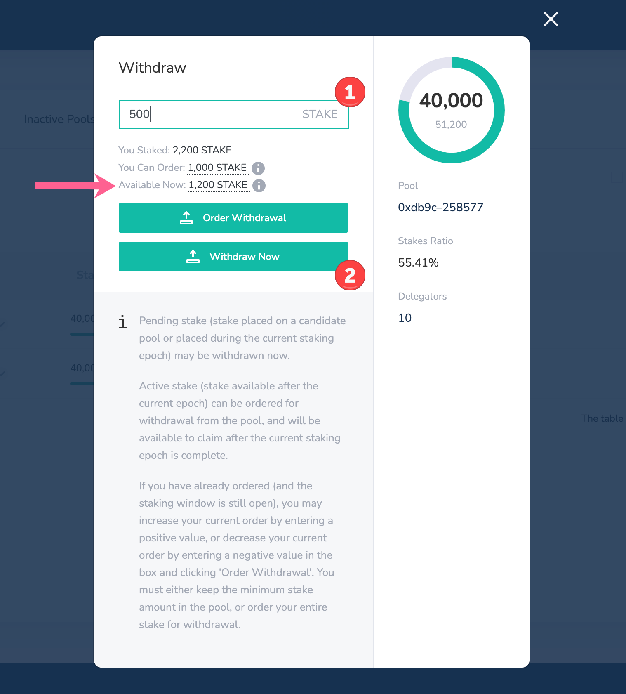

# Withdraw LATAM Stake

Stake can be withdrawn from a pool and deposited back to your web3 wallet address. You can withdraw the entire amount to exit a pool, or withdraw a portion as long as the minimum required stake remains in the pool. Funds are either available for immediate withdraw or ordered withdrawal depending on the circumstances.

#### Immediate withdrawal:

* Stake placed on an active candidate pool that is not a validator, or an inactive pool, is available to withdraw at any time\*
* Stake placed on an active validator pool can be withdrawn **during the same staking epoch in which it was placed.**
* Stake cannot be withdrawn from a banned pool until the ban is complete.

#### Ordered withdrawal:

* Active stake, in use by a current validator pool, can be ordered for withdrawal. This order is processed at the end of the current staking epoch, and available to claim in the subsequent staking epochs.
* The amount of stake ordered for withdrawal may be increased or decreased.


\*_**Note:**_ _You cannot add, move or withdraw stake when the staking window is closed. This occurs at the very end of each staking epoch \(~ the final 6 hours\), where all staking actions are inactive._


### Immediate Withdrawal Instructions \(Available Now\):

1\) Check that your [web3 wallet is connected with the correct address](../../../for-users/wallets/metamask/metamask-setup.md) and you have enough [USD](../../../for-users/get-USD-tokens/) to process the transaction.

2\) Click the Withdraw icon next to the pool you would like to withdraw from. The icon will only appear if a withdrawal of some type is possible.

3\) The maximum amount you can withdraw is shown next to Available Now _\(See below for order withdrawal instructions if you do not see Available Now\)_.  

1. Enter in an amount up to the Available Now amount. If you do not have current active stake and enter the full amount, you will be removed from the pool. \(In the example below we are already Staking 1000, so removing the 1200 will not result in leaving the pool\).
2. Click the **Withdraw Now** button and follow the web3 wallet prompts to confirm the transaction.

4\) Once the transaction is processed, the withdrawn amount will be immediately reflected in your balance.

### Ordered Withdrawal Instructions \(You Can Order\)



1\) Check that your [web3 wallet is connected with the correct address](../../../for-users/wallets/metamask/metamask-setup.md) and you have enough [USD](../../../for-users/get-USD-tokens/) to process the transaction.

2\) Click the Withdraw icon next to the active validator pool you would like to withdraw from. The icon will only appear if a withdrawal of some type is possible.

3\) Enter the amount to order. If an order is available, you will see the amount you staked and the **Amount Available after the current epoch**. You can order the entire amount to exit the pool at the end of the staking epoch, or order any amount to withdraw up to the minimum amount required to stay in the pool.

4\) Click the **Order Withdrawal** button and follow the web3 wallet prompts to confirm the transaction.

5\) Once you have placed an order, you can **adjust the amount ordered during the current staking epoch**. Open the withdrawal icon and you will see your staked amount, the total amount available, and a new **already ordered** item, which will show the amount previously entered in step 3.

1. To order an additional amount to withdraw, follow steps 3 and 4 to complete an additional transaction, adding this amount to your previous order.
2. To **reduce the amount ordered \(action can only be performed during the same epoch\), enter a - in front of the number**. For example, if you have already ordered 500, but want to reduce that to 300, enter -200 in the amount field. This will adjust the order to 300.

6\) The order will process at the end of the staking epoch, and your funds will be available to claim. If you ordered your entire stake from the pool, you will no longer be a delegator with that pool.

