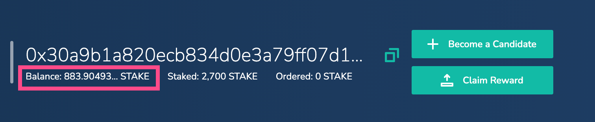
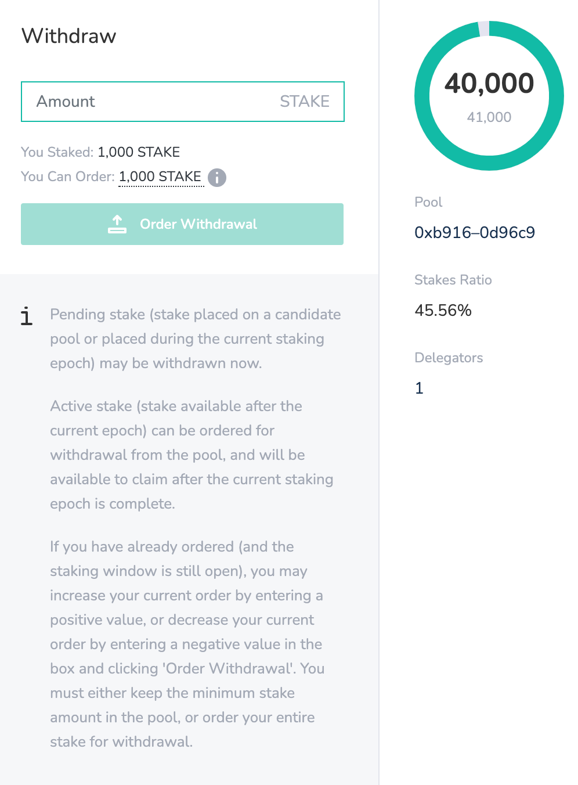

# Operational Terms



* [Active Stake ](operational-terms.md#active-stake)
* [Balance ](operational-terms.md#balance)
* [Ban ](operational-terms.md#ban)
* [Block Number](operational-terms.md#block-number)
* [Claim Reward ](operational-terms.md#claim-reward)
* [Claim LATAM Ordered Withdrawal ](operational-terms.md#claim-ordered-withdrawal)
* [Minimum Stake ](operational-terms.md#minimum-stake)
* [Mining Address ](operational-terms.md#mining-address)
* [Move Stake ](operational-terms.md#move-stake)
* [Order Withdrawal ](operational-terms.md#order-withdrawal)
* [Pending Stake ](operational-terms.md#pending-stake)
* [Remove my Pool](operational-terms.md#remove-my-pool)
* [Source Pool ](operational-terms.md#source-pool)
* [Stake, Staked ](operational-terms.md#stake-staked)
* [Staking Address ](operational-terms.md#staking-address)
* [Staking Window](operational-terms.md#staking-window)
* [Stakes Ratio](operational-terms.md#stakes-ratio)
* [Target Pool](operational-terms.md#target-pool)



### Active Stake

Stake currently in use by the validator set is called active stake. A snapshot of the amount of active stake is captured at the beginning of each staking epoch and used as the basis for reward distribution among validator pools at the end of the epoch.

Additional stake can be placed on validator pools during a staking epoch, however, this is [pending stake](operational-terms.md#pending-stake) and does not impact the pool until the next staking epoch. Active stake cannot be withdrawn or moved during a staking epoch, but it can be ordered for withdrawal \(the withdrawal amount can be claimed beginning with the next staking epoch\).

### Balance

The balance is the amount of LATAM available on a participant’s address \(available in their wallet\) connected to Latam-Blockchain. Any available LATAM balance will show when a participant connects to the staking application using a web3 browser extension \(like MetaMask or NiftyWallet\) and changes the RPC to Latam-Blockchain. [_MetaMask Instructions to connect to Latam-Blockchain_](../../../for-users/wallets/metamask/metamask-setup.md)_._ 

The available balance, along with the current staked amount, is displayed below the connected address in the UI. If LATAM is acquired on the Ethereum mainnet through an exchange or other means, it must be converted to LATAM in Latam-Blockchain using the bridge before it is reflected in the balance and available for use on Latam-Blockchain.

### Ban

A ban occurs due to validator misbehavior. This may include:

* not revealing a secret number more than 55 times in a staking epoch
* not revealing a secret number on the last reveal round of a staking epoch
* reported malicious behavior by other validators

  \(for example releasing 2 blocks at the same step or releasing a block out of order\) 

* too many calls to the reportMalicious function \(spam calls\)

When a validator is banned, they are immediately removed from the current staking epoch and moved to the inactive pool list. They do not receive any rewards from the staking epoch. The current validators \(minus the banned pool\) are reinstated and rewards are distributed among the remaining validators at the end of the staking epoch.

Any funds in the pool \(validator and delegator stakes\) are frozen for a period of 90 days. During that time, the mining address of the banned validator is prevented from participating in an active pool. At the end of 90 days, the funds are released and can be withdrawn or moved to another pool, and the ban is lifted.

To reactivate a banned pool after the 90 day ban is complete, a candidate must increase their stake by any amount, as long as the total amount is equal to the minimum candidate stake requirements. Adding stake calls the `stake` function and reinstates the pool.

### Block number

Each block in the chain is numbered sequentially starting from the genesis block. The block number displayed in the BlockScout interface corresponds to block height; it is the most current block in the chain.

### Claim Reward

Block rewards are tallied and available to claim at the end of each staking epoch. Distributions must be claimed by validators and delegators that were active during that epoch. This manual claim process transfers the participant's reward from the contract to a participant's wallet. Validators must use their staking address to claim, and delegators must use their delegation address. Users can specify claims for specific staking epochs or claim rewards for all past staking epochs. [Instructions and details on the claim reward process](../staking-operations/claim-stake.md).

### Claim Ordered Withdrawal

Stake ordered for withdrawal is available to claim once the staking epoch in which the claim was ordered is complete. To claim an ordered withdrawal, simply click on the Withdraw/Claim button and claim the ordered amount from the popup window. The claim will be processed through a web3 connected wallet, and will require a minimal amount of USD to complete the transaction. 


[Instructions and details on the claim ordered withdrawal process.](../staking-operations/claim-stake.md#claim-ordered-withdrawals)


### Minimum Stake

A pool must contain at least the minimum amount of stake from a candidate in order to become active. Minimum stake requirements exist for validator candidates as well as for delegators. The minimum stake amount for delegators is much lower. The following amounts are subject to change based on chain governance. These are the current minimums as of July 13, 2021.

* Validator candidates: 20.000 LATAM.
* Delegators: 200 LATAM per candidate. Stake may be placed on multiple candidates, but at least 200 LATAM must be placed on each candidate/validator.

If a candidate tries to place an amount of stake that does not meet the minimum stake requirements, their pool is not created.

### Mining Address

The mining address is used by a validator’s node to sign blocks, participate in the randomness beacon, and report on any malicious validators. Mining addresses have the ability to call certain functions using a zero gas price. This address must be configured on the node and provided to the interface when becoming a candidate.

To start, generate a new Ethereum address and corresponding private key using tools such as MyCrypto, Metamask etc. Create a new account and export and save the private key.

[Next, follow the instructions for setting up a new Latam-Blockchain node](../../../for-validators/new-validator-process-flow/). You will provide the mining address and JSON keystore password during node setup.

Once your node is ready, you can become a candidate through the web UI. You will enter in the node’s mining address during this process.

### Move Stake

Delegators and candidates can move stake between different candidate pools. Stake can be moved from active \(non-validator\) or inactive candidate pool at any time. If stake was placed on a current validator during the current staking epoch, it is pending stake and may be moved. However, stake placed on a current validator during a previous epoch which is currently in use \(active stake\), and cannot be moved. To reallocate active stake, follow the [order a withdrawal process](../staking-operations/withdraw-stake.md#ordered-withdrawal).


[Instructions and details on moving LATAM](../staking-operations/move-stake.md)


### Order Withdrawal

Active stake cannot be immediately withdrawn by a delegator or validator from a validator pool, however, an order may be placed to withdraw this stake. Once the epoch is complete, the ordered amount is available to claim.

To order a withdrawal, click on the withdraw icon associated with the validator pool you would like to withdraw from. 

The withdraw popup will appear. Enter the withdrawal order amount. If this is an active validator, the Withdraw Now button will be inactive, and the Order Withdrawal button will be active. Click the Order Withdrawal button to complete the order.

If an order for withdrawal has already been placed during the current staking epoch, it is possible to update this order using the same interface. Entering an additional positive amount will increase the order withdrawal, and entering a negative amount will decrease the order accordingly. Withdrawal orders can be claimed once the current staking epoch is complete and a new staking epoch begins.


[Instructions and details on the Withdrawal Order process.](../staking-operations/withdraw-stake.md)


### Pending Stake

Pending stake is stake placed during the current staking epoch which is not yet activated. It does not impact the current staking epoch. Pending stake can be moved, increased, or withdrawn during the open staking window. Once the window is closed, any placed stake is frozen until the next staking epoch begins. If it is placed on pool which becomes a validator, it becomes active stake and is unavailable to move in the next staking epoch. If placed on a pool which does not become a validator, it remains as pending for the next staking epoch.

### Remove My Pool

The Remove My Pool function is only available to candidate pools, and removes a pool from selection consideration for the next staking epoch. It moves candidate's/validator's active pool to the inactive pools list, and ensures that a current validator pool completes the current staking epoch but does not participate in new validator set selection at the end of the epoch.

The Remove My Pool link appears in the header \(instead of the become a candidate button\) when the application is accessed using an associated staking address. Clicking on this link will initiate the transaction to move the pool to the inactives list. All staked funds will remain in the pool during this process.

### Source Pool

The pool where current LATAM is allocated. This term is used when moving LATAM. It is moved from the Source pool to the Target Pool. 


[More on Moving Stake](../staking-operations/move-stake.md)


### Stake, Staked 

Stake is an amount of LATAM tokens deposited into the protocol by validators, candidates, and delegators. Stake protects the protocol and promotes honest behavior; users who provide LATAM do not want to lose this stake or potential rewards due to malicious behavior \([See banning for details and consequences related to malicious behavior](operational-terms.md#ban)\). The total stake amount in a pool influences the likelihood of that pool’s selection to a validator set. The more stake contained in a candidate’s pool, the higher their probability of selection to a validator set.

Contrary to many Proof of Stake implementations, total pool stake amounts in POSDAO do not correspond to higher validator rewards. Each validator pool within a validator set receives the same reward for participating in consensus and securing the chain. However, staking percentages do impact distribution within each pool, as the amount of stake provided by delegators determines the amount of reward the validator and each of their delegators receive.

Stake is managed according to the following rules:

* Stake can be placed, moved, or withdrawn \(or ordered for withdrawal\) during the open staking window, which begins immediately after the staking epoch starts, and ends ~6 hours \(4332 blocks\) prior to the end of the staking epoch. No staking actions can take place outside of the staking window.
* Stake can be freely placed, moved, or withdrawn from candidate pools during a staking epoch.
* Stake may be placed on a current validator pool, however it will not impact current pool rewards or staking percentages until the following staking epoch. In this case, it is referred to as pending stake.
* Pending stake may be moved or withdrawn during the staking window.
* Active stake placed in a validator pool may be ordered for withdrawal. When the staking epoch is complete, this ordered amount may be claimed.

### Staking Address

The Ethereum address related to a candidate or validator and used to place stakes and collect rewards. The staking address is tied to the mining address when completing the Become a Candidate process.

A staking address is generated just like any other arbitrary Ethereum address. Ecosystem tools such as MetaMask or MyCrypto provide easy interfaces for address and private key creation. Staking addresses must be funded with enough LATAM to provide at least the minimum staking amount, and a small amount of USD to cover transaction fees.

### Staking Window / Open Staking Window

The period of time when stake may be placed on or withdrawn/ordered from a candidate or validator pool. The open staking window begins shortly after a staking epoch starts, and ends during the final ~6 hours of a staking epoch. During the disallow period \(when the window is closed\), stake may not be withdrawn, placed, or ordered. This function is in place to prevent manipulation of the incoming validator set at the end of an epoch.

### Stakes Ratio

The Stakes Ratio shows the amount of stake deposited in a validator’s pool relative to the total stake committed to all validator pools. For example, if the total staked amount for all validator pools is 30000, and the staked amount in a specified validator’s pool is 5000, the Stakes Ratio for this pool is 16.67%. A higher stakes ratio corresponds to a greater likelihood of selection to the next validator set \(when there are more than 19 candidates\).

### Target Pool

The pool LATAM will be moved to when shifting LATAM amounts from one pool to another. When moving LATAM, it moves from the Source pool to a Target Pool. 


[More on Moving LATAM Stake](../staking-operations/move-stake.md)


