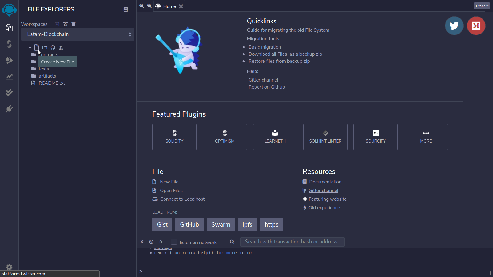
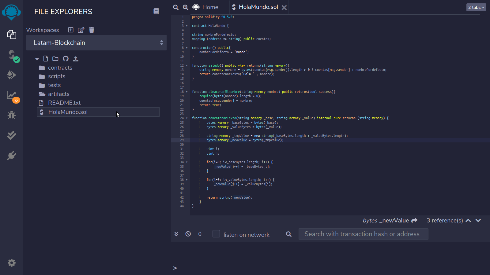
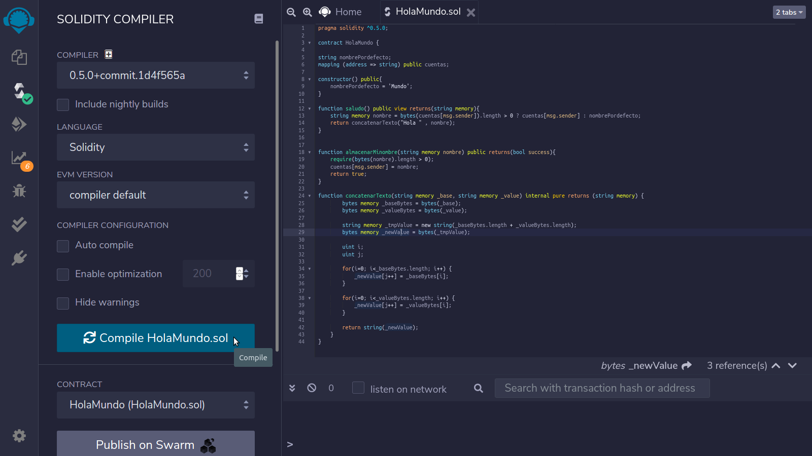
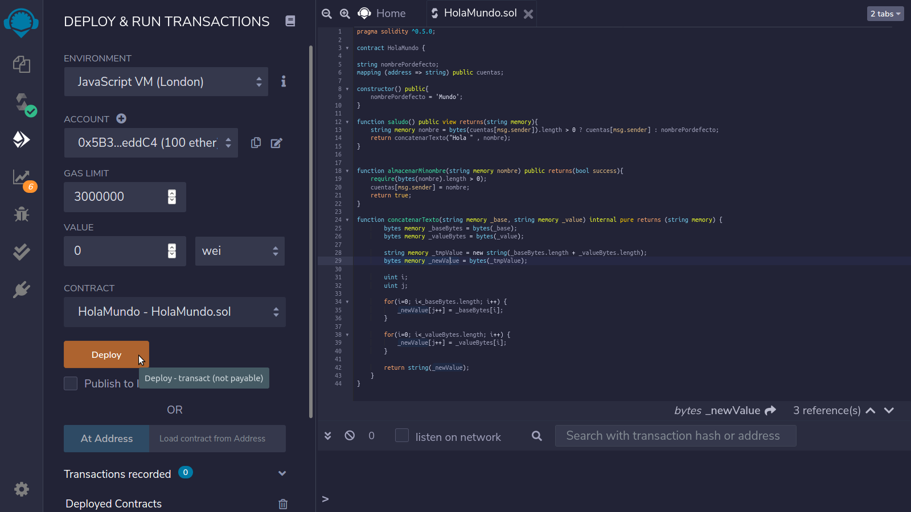
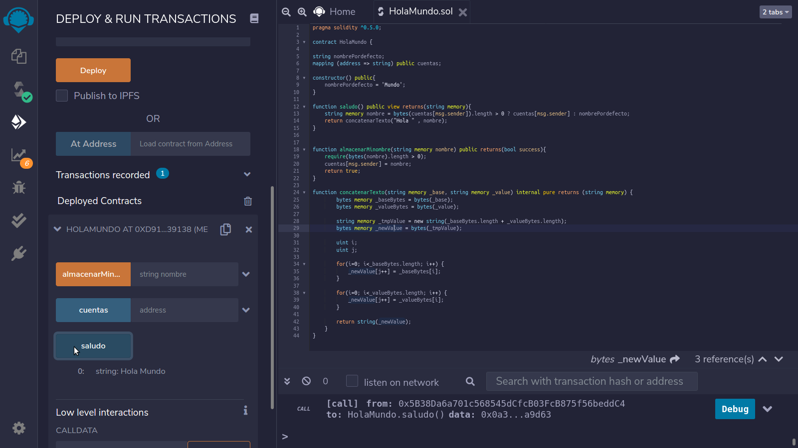
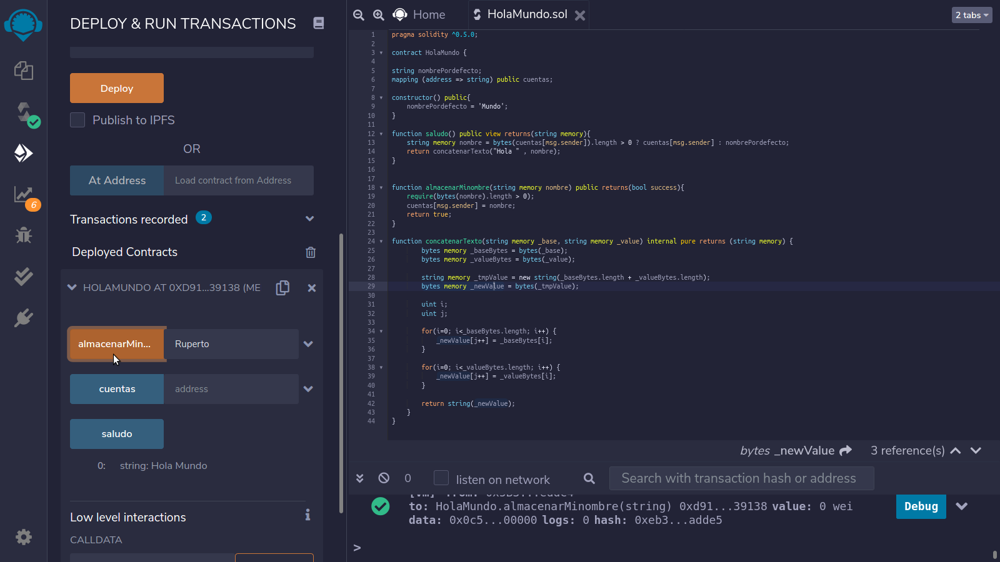
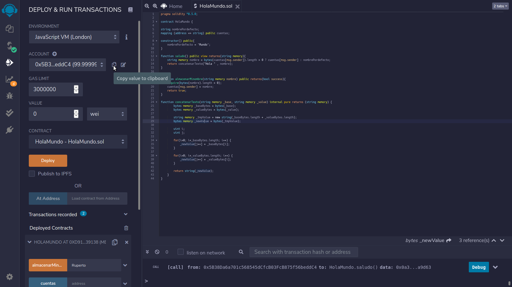
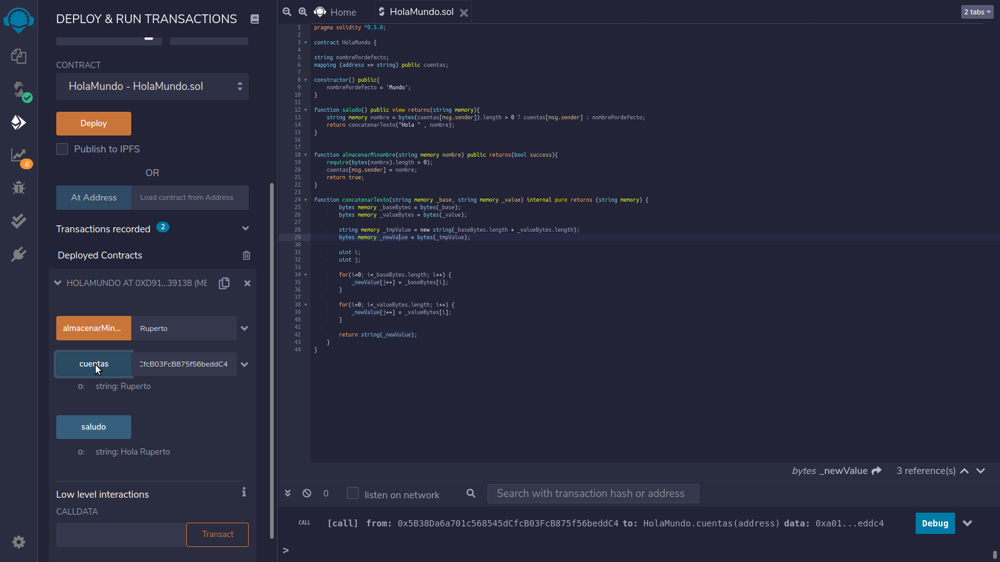

# Mi primer contrato inteligente

## ¿Que voy a aprender aquí?

* Estructura básica de un contrato inteligente en _Solidity_.
* Un contrato inteligente _HolaMundo.sol_, sus métodos y funciones.
* _Remix IDE_ para compilar, desplegar e interactuar con tu primer contrato inteligente. 


## Estructura básica de un contrato inteligente en _Solidity_

### Tipos de Variables: 
`bool, integer (int8-int256/uint8-uint256), address, bytes, string, hex and enum`

### Estructura del contrato:
```
<version del compilador>
 
contract NombreDelContrato{
 
<declaración de variables>
<mapping>
<constructor>
<funciones>
<modificadores>
 
}
```
### Sintaxis de una Función

```
function NombreDeLaFuncion(Argumentos…) <visibilidad> <mutabilidad de estado> returns (<tipo de variable>)

visibilidad:

public   — publico para todos
private  — solo para este contrato
internal — solo para este contrato y contratos que deriven del mismo
external — solo con acceso externo


mutabilidad de estado:

view – no modifica el estado del VM
pure – no lee ni modifica el estado
payable- para recibir transacciones, modificar el estado


tipos de variable:

bool, integer (int8-int256/uint8-uint256), address, bytes, string, hex and enum

```
*[mas sobre las funciones](https://docs.soliditylang.org/en/v0.7.0/contracts.html#functions)

*[mas sobre la visibilidad](https://docs.soliditylang.org/en/v0.7.0/contracts.html#visibility-and-getters)

*[mas sobre los tipos de variable](https://docs.soliditylang.org/en/v0.7.0/types.html#value-types)

## Tu primer contrato inteligente [HolaMundo.sol](HolaMundo.sol)

Version del compilador de solidity a usar.
```solidity
pragma solidity ^0.5.0;
```

Estructura básica del contrato que muestra "Hola Mundo" por defecto al llamar a la función `saludo()`
```solidity
contract HolaMundo {

string nombrePordefecto;
mapping (address => string) public cuentas;

constructor() public{
    nombrePordefecto = 'Mundo';
}

function saludo() public view returns(string memory){
    string memory nombre = bytes(cuentas[msg.sender]).length > 0 ? cuentas[msg.sender] : nombrePordefecto;
    return concatenarTexto("Hola " , nombre);
}
```


Función `almacenarMinombre()` permite al usuario modificar el nombre a quien va dirigido el saludo.
```solidity
function almacenarMinombre(string memory nombre) public returns(bool success){
    require(bytes(nombre).length > 0);
    cuentas[msg.sender] = nombre;
    return true;
}
```

Función `ConcatenarTexto()` se usa para unir "Hola" + "Nombre del saludo" , ya que en solidity no es posible concatenar textos directamente 'A' + 'B' = 'AB'.
```solidity
function ConcatenarTexto(string memory _base, string memory _value) internal pure returns (string memory) {
        bytes memory _baseBytes = bytes(_base);
        bytes memory _valueBytes = bytes(_value);

        string memory _tmpValue = new string(_baseBytes.length + _valueBytes.length);
        bytes memory _newValue = bytes(_tmpValue);

        uint i;
        uint j;

        for(i=0; i<_baseBytes.length; i++) {
            _newValue[j++] = _baseBytes[i];
        }

        for(i=0; i<_valueBytes.length; i++) {
            _newValue[j++] = _valueBytes[i];
        }

        return string(_newValue);
    }
}
```


## Compilación, despliegue e interacción con el contrato inteligente en Remix IDE

### Compilación

1 \) Desde tu explorador visita https://remix.ethereum.org/ 



2 \) Clic en `Create New File` y creas el archivo `HolaMundo.sol`



3 \) Copias el código del contrato y lo pegas en el archivo creado

[Código del contrato:](HolaMundo.sol)
```solidity
pragma solidity ^0.5.0;

contract HolaMundo {

string nombrePordefecto;
mapping (address => string) public cuentas;

constructor() public{
    nombrePordefecto = 'Mundo';
}

function saludo() public view returns(string memory){
    string memory nombre = bytes(cuentas[msg.sender]).length > 0 ? cuentas[msg.sender] : nombrePordefecto;
    return concatenarTexto("Hola " , nombre);
}


function almacenarMinombre(string memory nombre) public returns(bool success){
    require(bytes(nombre).length > 0);
    cuentas[msg.sender] = nombre;
    return true;
}

function concatenarTexto(string memory _base, string memory _value) internal pure returns (string memory) {
        bytes memory _baseBytes = bytes(_base);
        bytes memory _valueBytes = bytes(_value);

        string memory _tmpValue = new string(_baseBytes.length + _valueBytes.length);
        bytes memory _newValue = bytes(_tmpValue);

        uint i;
        uint j;

        for(i=0; i<_baseBytes.length; i++) {
            _newValue[j++] = _baseBytes[i];
        }

        for(i=0; i<_valueBytes.length; i++) {
            _newValue[j++] = _valueBytes[i];
        }

        return string(_newValue);
    }
}
```




4 \) Clic en _Solidity compiler_ y seleccionas el compilador _0.5.0+..._ del menu desplegable y a continuación clic en _Compile HolaMundo.sol_ y si no da ningun error ya tu contrato esta compilado.




### Despliegue 

1 \) Clic en _Deploy & run transactions_ 

2 \) Seleccionar _JavaScript VM(London)_ en el menu desplegable _ENVIRONMENT_ 

3 \) Clic en _Deploy_



### Interactúa con el contrato

Una vez desplegado el contrato inteligente hacer clic en el menu _Deployed Contracts_ y podrás ver las funciones del contrato


#### Función saludo() 

Muestra el saludo predeterminado "Hola Mundo" si no se ha modificado el estado previamente, esta función es de solo lectura y no requiere GAS ya que no realiza ninguna modificación del estado.

1\) Clic en _saludo_

`Llamada a HolaMundo.saludo() -> "Hola Mundo"`


 
#### Función almacenarMinombre() 

Modifica el nombre por defecto "Mundo" o el ultimo nombre almacenado y coloca uno nuevo definido por el usuario, esta función tiene un costo en GAS ya que modifica el estado.

1 \) Coloca _"Ruperto"_ en el campo de _almacenarMinombre_ y has clic en dicha función. 

`Transacción a HolaMundo.almacenarMinombre("Ruperto") -> "True"`



2 \) Clic en _saludo_ para verificar que el estado fue modificado y el mensaje del saludo es ahora personalizado

`Llamada a HolaMundo.saludo() -> "Hola Ruperto"`


#### Función cuentas()

Muestra el nombre almacenado para una dirección de monedero/cartera en especifico en este ejemplo estamos usado la cartera `0x5B38Da6a701c568545dCfcB03FcB875f56beddC4`, en tu prueba tu dirección de monedero o cartera sera diferente, esta función no consume Gas ya que no modifica el estado.

1 \) Copia tu dirección de cartera en el menu _ACCOUNT_  "Copy value to clipboard"




2 \) Pegas la cuenta de la cartera/monedero en uso en el campo de _cuentas_ y luego clic en la misma función

`Llamada a HolaMundo.cuentas() -> "Ruperto"`



