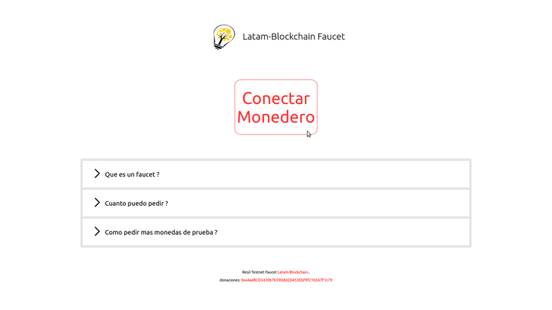

# Como obtener monedas de prueba?

1 \) Visita el [faucet](https://faucet.latam-blockchain.com) de Latam-Blockchain y clic en _Conectar Monedero_



2 \) Clic en _Metamask_ y al desbloquear tu moedero/cartera verifica que no eres un robot pasando el desafio _hCaptcha_


_Si estas usando tu Dispositivo móvil clic en WalletConnet y no en Metamask_


3 \) Click en _Recibir_ y se realizara la transaccion con los fondos de prueba

