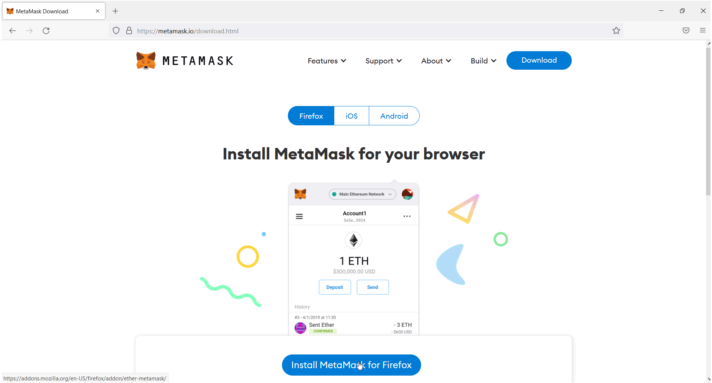
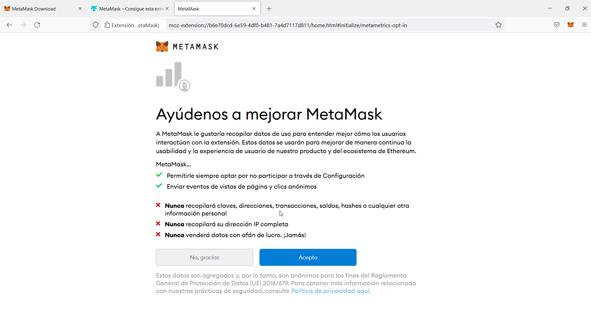
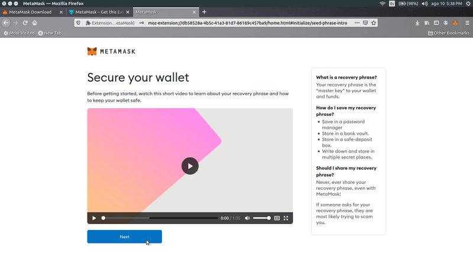

1 \) Visita [Instala MetaMask para Chrome, Firefox, Opera, iOS & Android](https://metamask.io/download.html)



2 \) Selecciona tu plataforma y clic en _Install MetaMask for Firefox_


En este ejemplo usamos el navegador firefox en pc.


3 \) Clic en _Add to Firefox_ y espera unos segundos por la instalación y clic en "Add Extension"

4 \) Clic en _Get Started_ y luego en _Create a Wallet_ para crear un monedero nuevo

5 \) Clic en _I Agree_ 

6 \) En la página _Create Password_,  introduce una clave para tu monedero en el campo  _New password (min 8 chars)_ , mínimo 8 caracteres!.

7 \) Repite la clave nueva en el campo _Confirm password_

8 \) Acepta los términos de uso haciendo clic en el recuadro _ I have read and agree to the Terms of Use _

9 \) Clic en _Create_

10 \) En la página de _Secure your wallet_ clic en _Next_

11 \) En la página de _Secret Backup Phrase_ clic en _ CLICK HERE TO REVEAL SECRET WORDS_


Para este ejemplo la frase de seguridad es _"release cloud shoot anger key picture credit punch verify isolate deposit shoot"_ , en tu instalación sera diferente.



ADVERTENCIA!!!!: Nunca muestres a un tercero la frase secreta o palabras de respaldo (las 12 palabras en ingles que te muestra al hacer clic en _ CLICK HERE TO REVEAL SECRET WORDS _). Cualquiera con esta frase puede tener acceso a tus fondos.

Almacena la frase anterior en un lugar seguro, escritas a mano preferiblemente, dicha frase o palabras de respaldo sirven para recuperar tu monedero en cualquier otro dispositivo y tener acceso a tus fondos.

El orden en que se muestran las palabras es importante, respalda las palabras con el orden correcto.

Recuerda, ser tu propio banco requiere responsabilidad!, oculta, cuida y respalda tu monedero...

_WIP_ agregar tutorial para importar/re establecer  un monedero a partir de la frase de seguridad. 


12 \) lee la advertencia anterior nuevamente. 

13 \) Clic en _Next_

14 \) En la página _Confirm your Secret Backup Phrase _, confirma que estas en custodia tu frase de recuperación, haz clic en cada una de las palabras de tu frase de respaldo en el orden correcto.

15 \) Clic _Confirm_ y luego clic _All Done_ y cierra el aviso informativo que te aparece en pantalla. Tu monedero metamask ya esta creado y conectado por defecto a la red de _Ethereum_, 

Si necesitas mas información de como instalar MetaMask y crear tu primer monedero visita este tutorial en video de _Blockchain Academy Chile_ donde te explica paso a paso la instalación y creación de tu primer monedero usando el navegador de internet Google Chrome.



