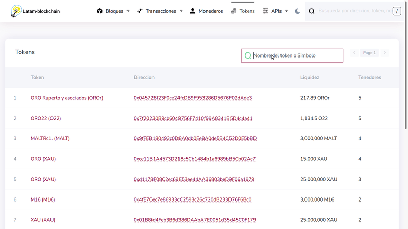

# Como agregar un token al Metamask?

1 \) Visita el [explorador de bloques](https://explorer.latam-blockchain.com/tokens) de Latam-Blokchain en la seccion de tokens.



2 \) Identifica en la lista el token o ingresa el nombre del token o el simbolo en el buscador.


verifica que la Direccion (ID) del token es el correcto, en la red pueden existir diferentes tokens con el mismo nombre y simbolo. 


Para este ejemplo estaremos usando el siguiente token:

- Nombre    :  _ORO Ruperto y asociados_
- Simbolo   :  _OROr_
- Direccion :  _0x045728f23F0ce24fcDB9F953286D5676F02dAde3_

3 \) Clic en el nombre del token y despues clic en copiar la direccion del token.

4 \) Entras en el Metamask y clic en _Add Token_.

5 \) Pegas la direccion del token en el campo _Token Contract Address__, clic en _Next_ y luego en _Add Token_.

