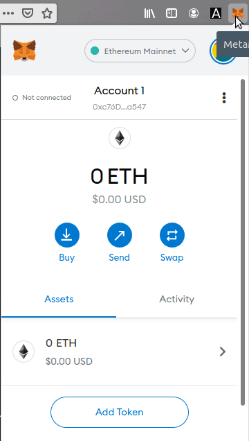

# Configuracion

## Configuración automatica

1 \) Visita [Chainlist](https://chainlist.org/) 

2 \) Busca _Resil_ en el campo "Search Networks"

3 \) En la red _Resil_ has clic "Connect Wallet" y luego en "Add To Metamask"

4 \) El el Metamask has clic en "Approve" y luego en "Switch network"


\Este método solo funciona para el Metamask en pc

\Este método no agrega el explorador de bloques a tu Metamask


## Configuración manual

1 \) Abrir y desbloquear el Metamask

2 \) En el menú desplegable hacer clic en "Settings"


_si estas usando MetaMask desde el computador "Settings" se encuentra haciendo clic en la imagen circular en la parte superior derecha_

_si estas usando MetaMask desde tu dispositivo móvil "Settings" se encuentra en el menú desplegable en la parte superior izquierda_


3 \) Hacer clic en "Networks"

4 \) Hacer clic en "Add Network"

5 \) Agregar la siguiente información de la red:

* _Network Name:_        Resil Testnet
* _New RPC URL:_         [https://rpc.latam-blockchain.com](https://rpc.latam-blockchain.com)
* _Chain ID:_               172
* _Currency Symbol:_     USD
* _Block Explorer URL:_  [https://explorer.latam-blockchain.com](https://explorer.latam-blockchain.com)

6 \) Hacer clic en "Save"

## Agregar tokens personalizados

_WIP_

## Conectar con tu Hardware Wallet

_WIP_

## Preguntas Frecuentes

_WIP_

